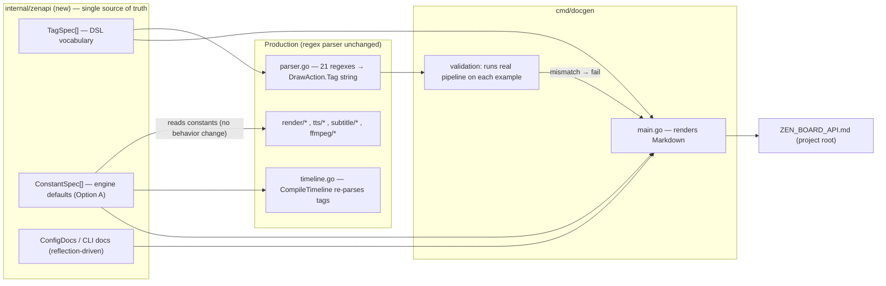

# Architecture Plan — Auto-Generated ZEN_BOARD_API.md via a Spec Registry (regex parser retained)

## Summary

Zen-board parses a `.zen` whiteboard-video DSL with a regex-based parser (`internal/script/parser.go`, 21 compiled regexes) that emits string-encoded `DrawAction.Tag` values later re-parsed by `internal/builder/timeline.go` (~14 `HasPrefix`/`Split` branches). The maintainable, long-term answer is neither "document the existing state by hand" nor "rewrite the parser today." It is a **single source-of-truth spec registry** that (1) generates a comprehensive `ZEN_BOARD_API.md` documenting every metric that affects a `.zen` output, (2) keeps production code honest by having it reference the registry constants, and (3) validates the documentation by executing the real parse pipeline against each documented example. The regex parser is retained unchanged; a lexer + recursive-descent backend is a defined future graduation point behind the same registry interface if the DSL grows nested/block grammar.

---

## System Boundaries & Component Breakdown



**Boundaries / ownership:**
- `internal/zenapi` is a **leaf package**: imports nothing from `internal/script`, `internal/builder`, `internal/render`, or `internal/tts`. Those packages import `zenapi` only for constants/schema. `main.go` and `cmd/docgen` sit at the top and import freely (no cycle).
- `cmd/docgen` imports `zenapi` + `internal/script` + `internal/model` (for reflection + validation). It does **not** import `internal/builder` for doc rendering — validation uses builder only inside a testable harness (see Data Flow).
- `ZEN_BOARD_API.md` is a **generated artifact**, committed to the repo and drift-checked; never edited by hand.

**Registry schema (v1):**
- `TagSpec{ Name, Kind(simple|standard|complex|draw), Syntax, Args[]Arg{Name,Type,Required,Default,Values,Doc}, Example, Since, Notes }`
- `ConstantSpec{ Name, Value, Group(section: draw|text|transition|camera|hand|...), Doc }` — production code references the exported value symbol.
- Config/CLI are **not** hand-maintained registries; shape is mined from `model.Project` (JSON tags + `NewDefaultProject` defaults via reflection) and a relocated flag-set declaration (`flags.FlagSet` visit), with a small description map for the human one-liners.

---

## Data Flow & State Management

```mermaid
flowchart LR
    subgraph GENERATION
        A["go:generate → go run ./cmd/docgen"]
        A --> B["read TagSpec[] + ConstantSpec[] + config/CLI reflection"]
    end
    SUBGRAPH VALIDATION
        B --> C["for each TagSpec: run Parse(Example)
⟶ SplitInlineWaits ⟶ stub CompileTimeline
on fixture assets + synthetic word timings"]
        C -->|"expect exact Actions[].Tag & arg values"| D{matches?}
        D -->|no| FAIL["docgen exits non-zero\nline:col of offender"]
        D -->|yes| E["coverage sweep: scan examples/*.zen\nvia script.Parse, diff prefix set vs TagSpec"]
    end
    B --> M["render Markdown
tags + constants + config + CLI (+ TTS/subtitle/ffmpeg notes)"]
    M --> F["ZEN_BOARD_API.md"]
    F --> CI["CI: go generate && git diff --exit-code\nZEN_BOARD_API.md"]

    subgraph RUNTIME (unchanged flow)
        PROSE[.zen] --> P2["parser.go → ScriptLine/Actions"]
        P2 --> C2["preprocessor.go SplitInlineWaits"]
        C2 --> T2["timeline.go CompileTimeline
reads zenapi constants"]
        T2 --> FR[FrameEvent → RenderPool → ffmpeg]
    end
```

**State management:**
- `zenapi` data is **immutable package-level state**, built once via `var` initializers (compile-time) — never mutated at runtime. No `map` lazily populated by multiple callers; this keeps `CompileTimeline`-time reads lock-free and avoids the unsynchronized-map-write risk (single-threaded compile path, but the invariant is explicit).
- Docgen holds **no persistent state**: it reads the registry, runs validation in-memory against a **fixture asset dir + synthetic `allWordTimings`**, and writes the Markdown. Output is deterministic → `git diff --exit-code` is a valid drift signal.
- Effective defaults that are multi-layer overrides (e.g. cursor: `NewDefaultProject` → `--cursor` → per-draw `cursor=` variant) are **documented as a cascade** in `ZEN_BOARD_API.md`, not asserted by the drift test (which only covers layer 1).

---

## Failure Modes & Mitigations

| # | Failure mode | Detection | Mitigation |
|---|---|---|---|
| 1 | Docs drift from parser/timeline behavior | CI `git diff --exit-code`; generation-time validation | Single registry; gen artifacts never hand-edited |
| 2 | Documented example no longer parses | docgen runs full pipeline per example | Generation **fails** with line:col |
| 3 | Regex change silently alters tag behavior | full-pipeline validation diff | Tag→action contract pinned by expected `Actions[].Tag` |
| 4 | **Real bug: unguarded slice indexing panics** `[arrow:only]`→`parts[1]` (timeline.go:624-625); `compare:` (timeline.go:689-690) | validation harness runs `CompileTimeline` | Panics surface in CI, not user runs. **Recommended (separate change):** schema-driven arg validation before dispatch turns panics into clean parse errors (see Decisions #6) |
| 5 | **Quote-split mismatch**: `[banner:"Chapter: One"]` shreds at `strings.Split(rest,":")` (timeline.go:585,623,…) not quote-aware | full-pipeline validation of such examples | Documented limitation in v1; add a `QuoteColonCases` example set to the harness to force visibility; structural fix belongs to the future parser revamp |
| 6 | New tag added but not documented | coverage sweep diff | `go generate` fails until registry entry added |
| 7 | Undocumented tag used only in `examples/*.zen` | sweep via `script.Parse` prefix set | Warning→hard fail (configurable) |
| 8 | Coverage-sweep false signals (`wait` lower→`WAIT:` uppercase; user-syntax vs internal-tag spaces) | — | Sweep inspects `Actions[].Tag`, not raw `.zen` text |
| 9 | Registry perforates → import cycle or god-object | code review + `go vet`/import `go list` check | `zenapi` leaf-only rule; split into files by concern (`tags.go`, `constants.go`), one package |
| 10 | Config/CLI drift | reflection eliminates the source duplication | No parallel spec to drift (see Decisions #3) |
| 11 | `draw:` open-ended `key=value` variants uncaptured by a simple sweep | documented | Variant keys covered by `TagSpec` example + manual note, not auto-swept (avoids reimplementing the parser) |
| 12 | AssetsDir doesn't exist during docgen validation | — | Harness uses a committed `testdata/` fixture asset dir; `CompileTimeline` asset-existence path satisfied |

---

## Key Decisions, Alternatives & Rejection Rationale

1. **Registry over "document the regexes by hand."** Alternative: write prose docs for each regex in `ZEN_BOARD_API.md` manually. *Rejected:* it recreates the exact drift pain the project already suffers (see stale `PROJECT_OVERVIEW.md`); docs can show usage the parser rejects.

2. **"Full parser revamp now" vs incremental.** Alternative: rewrite regex parser as lexer + recursive-def dialects immediately. *Rejected:* the DSL is currently flat `[tag]` atoms — regex is a fine lexer for that class; a rewrite now is heavy with no trapped demand. Deferred behind a **defined graduation trigger** (first nested/block/context construct).

3. **Config + CLI via reflection, not hand-maintained registries (red-team, folded).** Alternative: `ConfigSpec[]`/`CliSpec[]` + a drift test. *Rejected:* writing a duplicate then testing the duplicate hasn't drifted is waste. Derive name/type/default from `model.Project` (JSON tags + `NewDefaultProject`) and from a relocated `Flags(conf)` flag-set via `VisitAll`; only human one-liners live in a small description map.

4. **Keep regex parser unchanged (scope guard).** Alternative: schema-driven parsing / snippet-codegen of regexes from `TagSpec`. *Rejected:* contradicts the stated "keep regex, docs-first" scope and materially restructures `parser.go`. The registry is a doc + drift layer, not a runtime parse engine, in v1.

5. **`go:generate` + optional CI `git diff --exit-code`, alongside manual `go run ./cmd/docgen`.** Alternative: manual run only (user preference). *Risk:* it rots on memory-dependence. Recommendation captures both: the generator stays a plain `main`; `//go:generate go run ./cmd/docgen` and a CI diff step make drift automatic with ~2 extra lines. ([Decision deferred to my judgment via "write the plan now".])

6. **No runtime validation gate in v1.** Alternative (red-team's "defuse the landmine"): use `TagSpec{}` to validate parsed `DrawAction`s against arg schema *before* `CompileTimeline` dispatch. *Deferred:* it touches the runtime pipeline, outside the docs scope; but it is the highest-value future use of the registry and the only fix for the `arrow:`/`compare:` panics. Recorded as recommended Phase-2. The docs harness already drives `CompileTimeline` so it catches these panics in CI today.

7. **Docgen validation runs the full pipeline, not just `script.Parse`.** Alternative: validate only extraction (run `Parse`). *Rejected:* the bug-prone layer is `timeline.go` dispatch (panics + quote-split), which `Parse` alone can't see. Full-chain harness with fixtures is the only honest validation.

8. **Coverage sweep via `script.Parse` inspection, not regex-grep of `.zen`.** Alternative: grep raw `.zen` for `\[(\w+):`. *Rejected:* user syntax (lowercase, quoted) differs from internal tags (`WAIT:`, re-joined complex tags); grep would yield false gaps/positives.

9. **Option A: production reads constants from the registry.** Alternative: registry stores doc-only values (Option B). *Rejected (user choice):* A is drift-proof; B reintroduces doc-vs-code drift. Cost is a light, behavior-neutral refactor of scattered literals into registry constants referenced from `timeline.go`/`render/*`.

10. **Package/artifact naming.** `internal/zenapi` (not generic `internal/spec`/`core`), `cmd/docgen`. Split `zenapi` into `tags.go`/`constants.go` to avoid a god-file. Output `ZEN_BOARD_API.md` at project root (user-referenced location).

---

## Red-Team Critique Summary (`browser.chat`, provider=claude, with actual files)

| Point | Verdict | Notes |
|---|---|---|
| (a) Registry targets `specialPrefixes` duplication (parser.go prefixes vs timeline.go:152) — real bug; four registries overkill | **folded in** | Trimmed to `TagSpec`+`ConstantSpec`; the unify-tag-vocabulary win is the concrete payoff |
| (b) Behavioral `Parse`-only validation misses the bug-prone layer; arrow/compare panic at timeline.go:624-625/:689-690; quote-split shredding at :585/:623/… | **folded in** | Full pipeline harness + `QuoteColonCases` example set; panics caught in CI (Failure #4, #5) |
| (c) Concurrency: registry must be immutable, built once | **folded in** | Explicit invariant in State Management |
| (d) Manual run will rot; realistic evidence (`PROJECT_OVERVIEW.md` already stale) | **needs your input** → deferred to me by "write the plan now"; **folded in as Decision #5** (go:generate + optional CI diff) | |
| (e) Coverage sweep gaps: `WAIT:` remap, two string spaces, `draw:` variants | **folded in** | Sweep inspects `Actions[].Tag`; variants as documented limitation (Failure #8, #11) |
| (f) `CliSpec[]`/`ConfigSpec[]` are unnecessary duplication; only `TagSpec` justified | **needs your input** → folded in as Decision #3 | Reflection removes the duplicate + its drift test |
| (g) Schema's highest-value use is a pre-dispatch validation gate; cursor cascade is 3-layer; scope mismatch for a single-maintainer tool | **folded in / partially** | Decision #6 (gate deferred to Phase 2, harness catches panics now); cursor cascade documented not tested; minimalism honored but "every metric" coverage retained via reflection |

**Rejected:** none. All critiques were actionable and folded or deferred into decisions.

---

## Open Questions

1. **Phase-2 validation gate scope** — whether to ship the runtime schema-validation gate (Decision #6) as an actual code change after the docs harness is live. *Why unresolved:* it changes runtime behavior and touches `timeline.go`, deliberately outside this docs-first scope; it should be re-confirmed when the generator ships.

2. **Versioning discipline** — whether `TagSpec.Since` should reference real tagged releases, dates, or be dropped. *Why unresolved:* the project has no release-tagging convention visible in the repo; not resolvable from code alone.