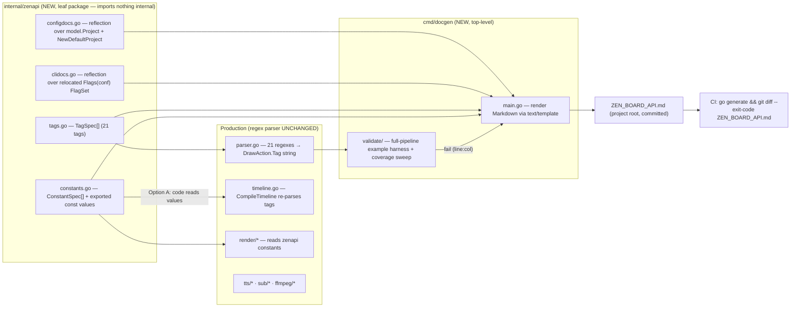
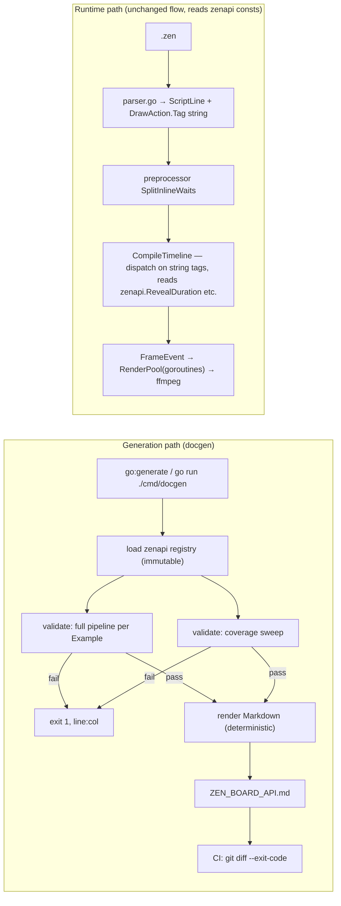

# Architecture Plan — Auto-Generated ZEN_BOARD_API.md via a Spec Registry (regex parser retained)

## 1. Summary

Zen-board parses a `.zen` whiteboard-video DSL with a regex-based parser (`internal/script/parser.go`, 21 compiled regexes) that emits string-encoded `DrawAction.Tag` values later re-parsed by `internal/builder/timeline.go` (~14 `HasPrefix`/`Split` branches). The maintainable, long-term answer is neither "document the existing state by hand" nor "rewrite the parser today." It is a **single source-of-truth spec registry** that (1) generates a comprehensive `ZEN_BOARD_API.md` documenting every metric that affects a `.zen` output, (2) keeps production code honest by having it reference the registry constants, and (3) validates the documentation by executing the real parse pipeline against each documented example. The regex parser is retained unchanged; a lexer + recursive-descent backend is a defined future graduation point behind the same registry interface if the DSL grows nested/block grammar.

---

## 2. Context & Current State (verified against code)

**Pipeline:** `.zen` → `script.Parse` → `SplitInlineWaits` → `builder.CompileTimeline` → `render` (goroutine pool) → `ffmpeg` → MP4. Word timings from the TTS orchestrator drive action triggers.

| Aspect | Finding | Evidence |
|---|---|---|
| Parser | 21 compiled regexes; output `DrawAction.Tag` is an **untyped string** encoding (e.g. `"slide:pyramids:fullscreen:fade:fill"`, `"compare:robot:world:\"Left\":\"Right\""`, `"WAIT:1.5"`, `"clear"`) | `parser.go:10-31`, `:96-262` |
| No error surface | `Parse(input string) []model.ScriptLine` — cannot express failures; `strconv.Atoi` errors ignored | `parser.go:33-51`, `:128-134` |
| Two-stage re-parse | `CompileTimeline` re-splits the tag strings: `specialPrefixes` slice (14 entries) + `HasPrefix`/`TrimPrefix`/`Split` branches | `timeline.go:152`, `:95-787` |
| Duplicated vocabulary | The tag-name list exists **twice**: parser.go regex prefixes AND timeline.go `specialPrefixes` — the real single-source-of-truth bug | `parser.go:185-204` vs `timeline.go:152` |
| Real crash bugs | `arrow:`/`compare:` index `parts[1]` unguarded → panic on single-arg input | `timeline.go:624-625`, `:689-690` |
| Quote-split mismatch | parser uses quote-aware `parseQuotedStringParts`; timeline re-splits with plain `strings.Split(rest,":")` → `[banner:"Chapter: One"]` shreds | `parser.go:53-70` vs `timeline.go:585,623,661,688,751,788` |
| Scattered constants | reveal `2.0`, opacity `0.5`, jitter `3.0`, colors, easing — inline literals across `timeline.go` and `internal/render/*` | `timeline.go:147,727,753,792`, `hand.go:132` |
| Existing tests | `parser_test.go` pins exact string tags; `preprocessor_test.go` covers wait-splitting | `internal/script/*_test.go` |
| Docs today | No `ZEN_BOARD_API.md`; `PROJECT_OVERVIEW.md` is already stale vs `main.go`'s actual render deps (cursor registry, event logger omitted) | project root |

---

## 3. Goals & Non-Goals

**Goals**
1. Auto-generate `ZEN_BOARD_API.md` documenting **every metric affecting a `.zen` output**: DSL tags, config.json fields, CLI flags, timeline defaults, render defaults, TTS/subtitle/ffmpeg behavior.
2. Zero-doc-debt: docs derived from a single source of truth; a new tag or constant costs exactly one registry edit.
3. Guarantee docs never show usage the parser rejects (behavioral validation through the real pipeline).
4. Keep the regex parser unchanged (docs-first scope).

**Non-goals (explicitly out of v1)**
- Rewriting the parser (regex retained).
- Runtime schema-validation gate that turns `timeline.go` panics into clean errors (recorded as Phase 2 payoff).
- Fixing the quote-split shredding bug (surfaced + pinned by tests, structurally fixed in the parser revamp).
- Generating documentation for non-`.zen` runtime concepts (frame pool tuning, ffmpeg internals) beyond what a script author needs to predict output.

---

## 4. System Boundaries & Component Breakdown



**Package layout (target):**
```
zen-board/
├── cmd/docgen/           ← NEW: generator main + template + validate harness
├── internal/zenapi/      ← NEW: tags.go, constants.go, configdocs.go, clidocs.go
├── internal/cli/         ← NEW: Flags(conf) *flag.FlagSet (moved from main.go, behavior-neutral)
├── internal/script/      ← UNCHANGED
├── internal/builder/     ← reads zenapi constants (Option A edits only)
├── internal/render/      ← reads zenapi constants (Option A edits only)
├── internal/model/       ← UNCHANGED
├── ZEN_BOARD_API.md      ← generated artifact, committed
```

**Import rules (enforced, not aspirational):**
- `zenapi` and `model` import nothing internal. `script`, `builder`, `render`, `cli` may import `zenapi` (constants only) and `model`.
- `cmd/docgen` imports `zenapi`, `script`, `model`, `cli`, and `builder` **only inside the validate harness**.
- A CI `go list -deps` / `go vet` check asserts `zenapi` stays leaf.

---

## 5. The Spec Registry (`internal/zenapi`)

### 5.1 Data model (Go pseudocode)

```go
// tags.go — one entry per DSL tag; the ONLY hand-maintained source of truth for the DSL.
type TagKind int
const (
    TagSimple   // bare single token: zoom, style, chapter, sfx, subtitle
    TagStandard // content + optional @x,y,w,h: text, erase, move, gen
    TagDraw     // content + variants + optional @x,y,w,h + optional trailing reveal-dur
    TagComplex  // quoted-string-aware multi-part: slide, banner, arrow, highlight, compare, transition, overlay, counter
    TagWait     // numeric seconds
    TagClear
)

type ArgSpec struct {
    Name     string   // "asset", "preset", "label", "opacity", ...
    Type     string   // "asset-id" | "preset" | "quoted-string" | "int" | "float" | "color" | "enum" | "coord"
    Required bool
    Default  string   // rendered as `default: 2.0s` in docs
    Values   []string // bounded enum, e.g. transition styles
    Doc      string   // one-liner effect on output
}

type TagSpec struct {
    Name     string     // "draw"
    Kind     TagKind
    Syntax   string     // human grammar: `[draw:<asset>[:<preset>][:<k>=<v>...][@<x>,<y>[,<w>,<h>]]]`
    Args     []ArgSpec
    Example  string     // `.zen` snippet; MUST parse to Expected
    Expected string     // normalized internal tag the pipeline must produce
    Since    string     // "v1" | "v3"
    Notes    string     // cascade/default caveats
}

// constants.go — engine defaults; production code references these values.
type ConstantSpec struct {
    Name  string // "RevealDuration"
    Value string // "2.0" (kept string for uniform rendering)
    Group string // "timeline.draw" | "timeline.text" | "render.hand" | "render.camera" | "subtitle" | "ffmpeg"
    Doc   string // one-liner effect on output
}
var RevealDuration = 2.0   // exported, referenced by timeline.go:147 (Option A)

// Registry accessors (immutable, build-once)
var tagSpecs = []TagSpec{ ... }        // var literal, compile-time
func AllTagSpecs() []TagSpec           // returns a copy; callers must not mutate
func AllConstantSpecs() []ConstantSpec
```

### 5.2 Initial registry content (v1, ~21 TagSpec entries)

| Tag | Kind | Args (Name:Type:Required) | Defaults/Notes |
|---|---|---|---|
| `draw` | draw | asset:id·preset:enum·variant:kv·coord:coord | reveal 2.0s; cursor cascade; `cursor=` variant |
| `text` | standard | content:quoted-string·preset:enum·font-family·font-size:float·font-weight | sans/48/regular; MaskStyle ltr; HandStyle marker; persists |
| `erase` | standard | asset:id·coord:coord | `erase:*` wipes all; HandStyle eraser; MaskStyle ttb |
| `move` | standard | asset:id·preset:enum·coord:coord | HandStyle pencil; persists at dest |
| `gen` | standard | prompt:quoted-string·coord:coord | neural paint; MaskStyle diagonal; 512×512, steps 4; 1×1 placeholder on failure |
| `wait` | wait | secs:float | `WAIT:` internal; TriggerAfterWord when text precedes |
| `clear` | clear | — | resets grid; sentinel target |
| `zoom` | simple | preset:enum | viewport; 1.0s transition; always triggers at word start |
| `style` | simple | name:enum | whiteboard/blackboard/glassboard; text color + inversion |
| `chapter` | simple | title:quoted-string | ffmetadata chapter ms |
| `sfx` | simple | name | placeholder in v1 |
| `subtitle` | simple | state:enum | top/bottom/off; resolved per ASS chunk |
| `slide` | complex | asset·transition:enum·fitMode:enum·coord | 7 transitions; full-canvas default |
| `banner` | complex | title:quoted·subtitle:quoted·duration:float·color:color | 4.0s; 13-14% canvas height |
| `arrow` | complex | from·to·style:enum·duration:float | straight/curved; red; **panic risk single-arg** |
| `highlight` | complex | coord:coord·style:enum·duration:float | rect/circle/pulse; orange; dash |
| `compare` | complex | left·right·labelLeft:quoted·labelRight:quoted | border 4px; label pills; **panic risk** |
| `transition` | complex | type·duration:float | 0.5s; truncates active events; resets grid |
| `overlay` | complex | asset·opacity:float·preset:enum | 0.5; persists EndFrame 999999 |
| `counter` | complex | start:float·end:float·duration:float·format:enum | 0→0/2.0s/%d; center; freezes |

### 5.3 ConstantSpec initial set (mined by the earlier inventory)

`timeline.draw`: RevealDuration 2.0s, ZoomTransitionWindow 1.0s · `timeline.text`: defaultFontSize 48, TextMaskStyle ltr, TextHandStyle marker, PresetPadding 0.1 · `timeline.slide`: defaultTransition none, defaultFit fit, Transitions{none,fade,pop,slide-l/r/u/d} · `timeline.banner`: defaultDuration 4.0s · `timeline.arrow`: defaultStyle straight, defaultDuration 1.0s · `timeline.highlight`: defaultStyle rect, defaultDuration 2.0s · `timeline.overlay`: defaultOpacity 0.5, defaultPreset fullscreen · `timeline.transition`: defaultDuration 0.5s · `timeline.counter`: start 0, end 0, duration 2.0s, format %d, preset center · `render.hand`: SpriteSize 256, jitterAmp 3.0, angleClamp ±25°, HandOffset ±1/3 · `render.camera`: epsilon 0.5px, transitionFrames 1.0·FPS · `render.mask`: amplitude 0.025, wavelength 60, feather 0.06 · `render.text`: padding 10, DPI 72 · `render.easing`: EaseInOut smoothstep · `render.annotate`: arrowColor #EB4034, strokeWidth 6, highlightColor #FFA500 · `render.banner`: panelHeight 13% clamp[80,160], accent #008FFF · `render.bg`: default white, blackboard #0F0F0F, glassboard #181C25 · `subtitle`: fontSize h/18 min12, MarginV h/20 min5, chunk 10 words · `tts`: synth concurrency 1, fallback 24k mono 16-bit · `ffmpeg`: crf 18, preset fast/ultrafast, aac 192k.

### 5.4 Config & CLI docs — reflection, NOT a registry (red-team point (f))

```go
// configdocs.go
func ConfigDocs() ([]ConfigDoc, error) {
    p := model.NewDefaultProject()
    t := reflect.TypeOf(model.Project{}); v := reflect.ValueOf(p).Elem()
    for i := 0; i < t.NumField(); i++ {
        f := t.Field(i)
        doc := ConfigDesc[f.Name]            // small map: only the human one-liner
        docs = append(docs, ConfigDoc{
            Name: f.Tag.Get("json"),         // exact config.json key
            Type: f.Type.Kind().String(),
            Default: fmt.Sprintf("%v", v.Field(i).Interface()),
            Doc:  doc,
        })
    }
}
```

- **No `ConfigSpec[]`** — name/type/default are derived, so a new `Project` field appears in docs automatically (description `"(undocumented)"` until a `ConfigDesc` line is added). There is nothing to drift-test.
- **CLI docs** require the flag definitions to be importable. Move `main.go:76-129` flag registration into `internal/cli.Flags(conf *model.Project) *flag.FlagSet`, with `main.go` calling it (behavior-neutral). docgen then calls `cli.Flags(model.NewDefaultProject())` and iterates `fs.VisitAll()` for name/usage/default. Flag defaults that differ from `NewDefaultProject` (e.g. `-hand` default `./assets/hand.png`) are rendered as-is — the cascade is documented, not flattened.

---

## 6. Doc Generator (`cmd/docgen`)

### 6.1 Pipeline (pseudocode)

```go
func main() {
    // 1. Load immutable registry
    tags    := zenapi.AllTagSpecs()
    consts  := zenapi.AllConstantSpecs()
    cfgDocs := zenapi.ConfigDocs()
    cliDocs := zenapi.CLIDocs()

    // 2. Validate BEFORE rendering (fail = no doc written, non-zero exit)
    errs := validate.AllExamples(tags)     // full pipeline harness (§7.1)
    errs = append(errs, validate.CoverageSweep(tags) ...)  // §7.2
    if len(errs) > 0 {
        for _, e := range errs { fmt.Fprintln(os.Stderr, e) } // "line 3: unknown tag ..."
        os.Exit(1)
    }

    // 3. Render (deterministic: sorted sections, no timestamps)
    md := render.Render(tags, consts, cfgDocs, cliDocs, staticNotes)
    os.WriteFile("ZEN_BOARD_API.md", md, 0o644)
}
```

- **Determinism** is mandatory: sorted tag order, fixed number formatting, no generation timestamp → output is byte-stable → `git diff --exit-code` is meaningful.
- **Manual + automated**: `go run ./cmd/docgen` (user preference) and `//go:generate go run ./cmd/docgen` (drift automation). CI step: `go generate ./... && git diff --exit-code ZEN_BOARD_API.md`.

### 6.2 Markdown rendering

`text/template` with a `funcmap` (value formatting, backtick escaping, camel→kebab). One template file per section. Output structure:

```markdown
# zen-board Script API
> generated by cmd/docgen — do not edit by hand

## 1. Pipeline & Execution Model        [static prose]
   .zen → Parse → SplitInlineWaits → CompileTimeline → RenderPool → ffmpeg
   Word-trigger model: an action fires at word START; "+" suffix → word END; [wait] pads.
## 2. Invocation
   2.1 config.json          [reflection table: key | type | default | effect]
   2.2 CLI flags            [VisitAll table: flag | type | default | effect]
   2.3 Effective cascades   [static + registry Notes: cursor, camera, hand_tip]
## 3. DSL Reference
   3.1 Syntax rules         [static: quotes, @x,y,w,h, "+", presets, variants, inline-in-prose]
   3.2 Tag index            [table: tag | kind | since | one-line]
   3.3 Per-tag sections     [auto: Syntax / Args table / Defaults / Example / Since / Notes]
## 4. Timing & Word-Trigger Model         [static prose + wait/wordindex tables]
## 5. Timeline Defaults                  [ConstantSpec Group=timeline.*]
## 6. Render Defaults                    [ConstantSpec Group=render.*]
## 7. TTS / Subtitle / FFmpeg            [ConstantSpec Group=tts|subtitle|ffmpeg + static notes]
## 8. Changelog                          [from TagSpec.Since, grouped]
```

---

## 7. Validation Harness (`cmd/docgen/validate`)

### 7.1 Full-pipeline example validation (red-team point (b))

The bug-prone layer is `timeline.go` dispatch, not regex extraction. Every `TagSpec.Example` is run through the **real** chain with fixtures:

```go
func checkExample(spec TagSpec) error {
    lines := script.Parse(spec.Example)
    pLines := script.SplitInlineWaits(lines)
    conf := model.NewDefaultProject()
    conf.AssetsDir = filepath.Join(repoRoot, "testdata", "fixture-assets") // real PNGs
    wordTimings := syntheticTimings(pLines)   // 0.3s per word, deterministic
    result, err := builder.CompileTimeline(conf, wordTimings, pLines, 0.0, "")
    if err != nil { return fmt.Errorf("%q: %v", spec.Example, err) }
    if got := normalizedTagFromEvents(result); !matches(spec.Expected, got) {
        return fmt.Errorf("%q: expected tag %q, pipeline produced %q", spec.Example, spec.Expected, got)
    }
    return nil
}
```

**Additional example classes pinned by tests (not just curated happy paths):**
- `QuoteColonCases`: `[banner:"Chapter: One":"Sub":2.0:FF5555]` — forces the quote-split shredding bug to **surface in CI** (currently it panics/shreds silently); a known-failing marker documents the limitation until the parser revamp.
- `MalformedCases` (Phase 2): single-arg `[arrow:only]`, `[compare:only]` — currently panic (timeline.go:624-625, :689-690); harness recovers, records, and fails CI with a precise message.
- **Fuzz seed corpus**: `go test -fuzz FuzzParse` re-uses `Examples` + `MalformedCases` to prove `script.Parse` never panics on arbitrary input (parse layer only; timeline panic risk is separately pinned).

### 7.2 Coverage sweep (red-team point (e))

```go
func CoverageSweep(tags []TagSpec) []error {
    used := map[string]bool{}
    for _, f := range glob("examples/*.zen") {
        for _, line := range script.Parse(read(f)) {
            for _, a := range line.Actions {
                name := strings.SplitN(a.Tag, ":", 2)[0]
                if name == "WAIT" { name = "wait" }          // internal→syntax remap
                used[name] = true
            }
        }
    }
    // fail: used-not-registered; warn: registered-not-used (exhaustive-coverage gap)
}
```

- Inspects `Actions[].Tag` (post-parse, normalized), **not** raw `.zen` text — avoids user-syntax vs internal-tag false signals.
- `draw:` variant keys (`cursor=`, ...) are **not** auto-swept (would require reimplementing the variant parser); they are covered by `TagSpec` args + Notes (documented limitation, Failure #11).

### 7.3 Drift & consistency tests (`internal/zenapi`)

| Test | Asserts |
|---|---|
| `TestRegistryCompleteness` | every tag prefix in parser.go / `timeline.go:152 specialPrefixes` has a `TagSpec` (the dedup payoff) |
| `TestConstantSpecMatchesCode` | `ConstantSpec.Value` string renders the same value as the exported const production references |
| `TestConfigDocsMatch` | reflection-derived defaults equal `NewDefaultProject` field values |
| `TestCLIDocsMatch` | relocated `cli.Flags(NewDefaultProject()).VisitAll` defaults match the registry-rendered table |
| `TestRenderDeterministic` | two renders byte-identical |

---

## 8. Production Integration — Option A Constants (user decision)

**Rule:** every documented engine constant becomes an exported symbol in `zenapi`; the consuming file imports and references it. No behavior change; literals move only.

Migration (mechanical, one constant per edit):
1. `timeline.go:147` `revealDuration := 2.0` → `zenapi.RevealDuration`
2. `timeline.go:238` `fontSize := 48.0` → `zenapi.DefaultFontSize`
3. `timeline.go:588/627/664/727/753/792` durations/opacity → corresponding specs
4. `hand.go:132` jitter 3.0; `camera.go:50` epsilon; `mask.go:15-21` config; `annotate.go` colors/strokes; `bg_utils.go` colors; `banner.go`/`engine.go` geometry → `zenapi.*`

**Constraint:** each migration is a `git grep`-verified one-liner, keeps test output identical, and is reviewed as "constants only". If a value ever needs to differ per-context (unlikely today), it stays a local literal **and** is flagged in `ConstantSpec.Notes` as divergent.

---

## 9. Data Flow & State Management



**State rules:**
- `zenapi` registry = **immutable compile-time data**. Read-only at runtime; no `map` populated by multiple callers → no lock needed, no unsynchronized-write risk (red-team point (c)).
- docgen = **stateless**: reads registry + fixture assets, writes one file, deterministic.
- Runtime state unchanged: `CompileTimeline` remains single-threaded pre-pool; worker-pool state untouched.

---

## 10. Failure Modes & Mitigations

| # | Failure mode | Detection | Mitigation |
|---|---|---|---|
| 1 | Docs drift from parser/timeline behavior | CI `git diff --exit-code`; gen-time validation | Single registry; generated artifact never hand-edited (§6.1) |
| 2 | Documented example stops parsing | docgen full-pipeline harness | Generation fails with exact example + message (§7.1) |
| 3 | Regex edit silently changes tag behavior | `TagSpec.Expected` mismatch in harness | Action→tag contract pinned per example |
| 4 | **Panic bugs** — `[arrow:only]`/`[compare:only]` unguarded `parts[1]` | harness runs `CompileTimeline` on MalformedCases; CI fails | Panics caught in CI not user runs; Phase 2 = schema gate fixes root cause |
| 5 | **Quote-split shredding** — `[banner:"Chapter: One"]` | `QuoteColonCases` fail loudly in CI | Documented known-bad; structural fix deferred to parser revamp |
| 6 | New tag added but undocumented | coverage sweep (used-not-registered) | `go generate` fails until `TagSpec` added |
| 7 | Tag documented but never exercised | coverage sweep (registered-not-used) | Warning; keeps example corpus honest |
| 8 | Sweep false signals (`WAIT:` uppercase, complex-tag rejoin) | — | Sweep inspects `Actions[].Tag` not raw text (§7.2) |
| 9 | `zenapi` perforation → import cycle / god-object | `go vet` + `go list -deps` CI check | Leaf-only rule; files split by concern (tags/constants/config/cli) |
| 10 | Config/CLI drift | reflection eliminates duplicate source | No parallel spec to drift (§5.4) |
| 11 | `draw:` open-ended variants uncaptured | — | Documented limitation; covered by Args+Notes, not auto-sweep |
| 12 | `CompileTimeline` needs real assets + word timings in docgen | — | Committed `testdata/fixture-assets` + deterministic synthetic timings (§7.1) |
| 13 | ConstantSpec value ≠ production const | `TestConstantSpecMatchesCode` | Fails CI (§7.3) |
| 14 | Non-deterministic render (timestamp, map order) | `TestRenderDeterministic` + CI diff | Sorted iteration, fixed formats, no timestamp (§6.1) |

---

## 11. Key Decisions & Alternatives

| # | Decision | Alternative | Rejection rationale |
|---|---|---|---|
| 1 | Registry over hand-written docs | Prose docs for each regex | Recreates drift pain; stale docs already proven (`PROJECT_OVERVIEW.md`) |
| 2 | Keep regex parser; docs-first | Full parser rewrite now | DSL is flat `[tag]` atoms; regex is a fine lexer for that class; no trapped demand yet. Graduation trigger defined (§12) |
| 3 | Config/CLI via reflection (no `ConfigSpec`/`CliSpec`) | Hand-maintained specs + drift test | Duplicate-then-test-the-duplicate is waste (red-team f) |
| 4 | Tag vocabulary unified in `TagSpec` | Leave parser.go prefixes + timeline.go `specialPrefixes` duplicated | This dedup is the concrete SSOT win; `TestRegistryCompleteness` enforces it (red-team a) |
| 5 | Full-pipeline example validation | Validate `script.Parse` only | Bug-prone layer is `timeline.go` dispatch; `Parse`-only gives false confidence (red-team b) |
| 6 | `go:generate` + optional CI drift check **and** manual `go run` | Manual only (user pref) | Memory-based regeneration rots; evidence in repo (red-team d). Generator stays a plain `main` |
| 7 | No runtime schema gate in v1 | Pre-dispatch `DrawAction` validation | Touches runtime pipeline, outside docs scope; highest-value Phase 2 (red-team g) |
| 8 | Option A: production reads registry constants | Option B: registry doc-only | A is drift-proof by construction; B reintroduces doc-vs-code drift (user decision) |
| 9 | Coverage sweep via `script.Parse` inspection | Grep raw `.zen` for `\[(\w+):` | Two string spaces (user syntax vs internal tags) → false gaps (red-team e) |
| 10 | `cmd/docgen` renders via `text/template`, deterministic | Hand-rolled `fmt` Markdown | Templates = structured, one file per section; determinism is a hard requirement |
| 11 | `internal/zenapi` + `internal/cli` packages | Stuff specs into `internal/model` | Keeps `model` a pure domain leaf; `zenapi` owns the documented API surface; AGENTS naming rule (single-domain) |

---

## 12. Graduation Path — Lexer + Recursive Descent (if DSL grows)

**Trigger (any of):** nested/balanced delimiters, block end-tags (`[scene]…[/scene]`), multi-line comments, context-sensitive `:` semantics.

**Constraint:** Backend B must produce **identical `[]model.ScriptLine`** for the entire existing corpus (`examples/*.zen` + all `TagSpec.Example`). Enforced by a golden-corpus parity test reusing the docgen harness. The registry interface (`TagSpec`, `Expected`) is unchanged → migration is a localized scanner swap, not a rewrite.

**Cheap-to-add-now (recommended, no behavior change):** escaping (`\"`, `\:`, `\]`) in the schema-driven arg parser, so the DSL is future-proof without restructuring.

---

## 13. Implementation Phases & Milestones

| Phase | Scope | Exit criteria |
|---|---|---|
| **P0** | Move flag definitions to `internal/cli.Flags(conf)`; `main.go` calls it | `go build`; CLI behavior byte-identical (`-h` output unchanged) |
| **P1** | `internal/zenapi`: `TagSpec[]` (21 tags), `ConstantSpec[]`, reflection `ConfigDocs` | `TestRegistryCompleteness`, `TestConfigDocsMatch` green |
| **P2** | Option A migration: `timeline.go`/`render/*` read `zenapi` constants | `TestConstantSpecMatchesCode` green; full test suite unchanged |
| **P3** | `cmd/docgen`: template rendering, full-pipeline harness, coverage sweep, `//go:generate`, CI diff step | `ZEN_BOARD_API.md` generated, deterministic; docgen exits 0; CI passes with diff clean |
| **P4** | Hardening: `MalformedCases`, `QuoteColonCases`, fuzz seed corpus, `go vet` import-graph check | CI fails fast on panic/shred regressions; FuzzParse no panics |
| **P5 (future)** | Schema-driven runtime gate; parser revamp if graduation triggered | Panics become clean line:col parse errors |

---

## 14. Test Strategy

- **Unit** (`internal/zenapi`): registry completeness, constant-value consistency, reflection defaults, deterministic render.
- **Integration** (`cmd/docgen/validate`): full pipeline per `TagSpec.Example`; sweep; malformed + quote-colon case classes.
- **Contract**: `parser_test.go` string-tag assertions retained (they pin the current contract); docgen must stay green against them.
- **Fuzz**: `FuzzParse` over corpus (parser layer panic-freedom).
- **Golden**: deterministic render → committed snapshot + CI diff.

---

## 15. Red-Team Critique Summary (`browser.chat`, provider=claude, actual files attached)

| Point | Verdict | Disposition |
|---|---|---|
| (a) Registry should target the duplicated tag vocabulary (`specialPrefixes` vs parser.go prefixes); 4-registry design overkill | **folded in** | Trimmed to `TagSpec`+`ConstantSpec`; `TestRegistryCompleteness` enforces dedup |
| (b) `Parse`-only validation misses the bug layer; arrow/compare panics; quote-split shredding | **folded in** | Full-pipeline harness + `MalformedCases` + `QuoteColonCases` (§7.1) |
| (c) Registry must be immutable, built once | **folded in** | §5.1 accessors return copies; explicit invariant (§9) |
| (d) Manual regen rots; repo already has a stale doc as proof | **needs your input** → deferred to me ("write the plan now") → **folded in as Decision #6** | `go:generate` + optional CI diff, generator stays a plain `main` |
| (e) Sweep gaps: `WAIT:` remap, two string spaces, draw variants | **folded in** | §7.2 inspects `Actions[].Tag`; variants documented limitation |
| (f) `CliSpec`/`ConfigSpec` unnecessary; only `TagSpec` justified | **needs your input** → **folded in as Decision #3** | Reflection replaces both (§5.4) |
| (g) Highest-value use = pre-dispatch schema gate; cursor 3-layer cascade; single-maintainer scope | **folded in / partial** | Gate deferred (Phase 5, Decision #7); cascade documented not tested; minimalism honored while coverage retained |

**Rejected:** none.

---

## 16. Open Questions

1. **Phase-2 runtime validation gate** — ship the pre-dispatch schema gate (Decision #7) after P4? *Why unresolved:* it changes runtime behavior and touches `timeline.go`; deliberately outside the docs-first scope and deferred to re-confirmation once the generator ships.
2. **Versioning discipline** — should `TagSpec.Since` reference real tagged releases, dates, or be dropped? *Why unresolved:* the repo shows no release-tagging convention; not resolvable from code alone.
3. **`sfx` tag** — currently a documented placeholder with no render consumer in `timeline.go` (only `sfx:` prefix recognized). Whether to document as "reserved" or wire a real sound effect is a product decision outside the docs generator.
