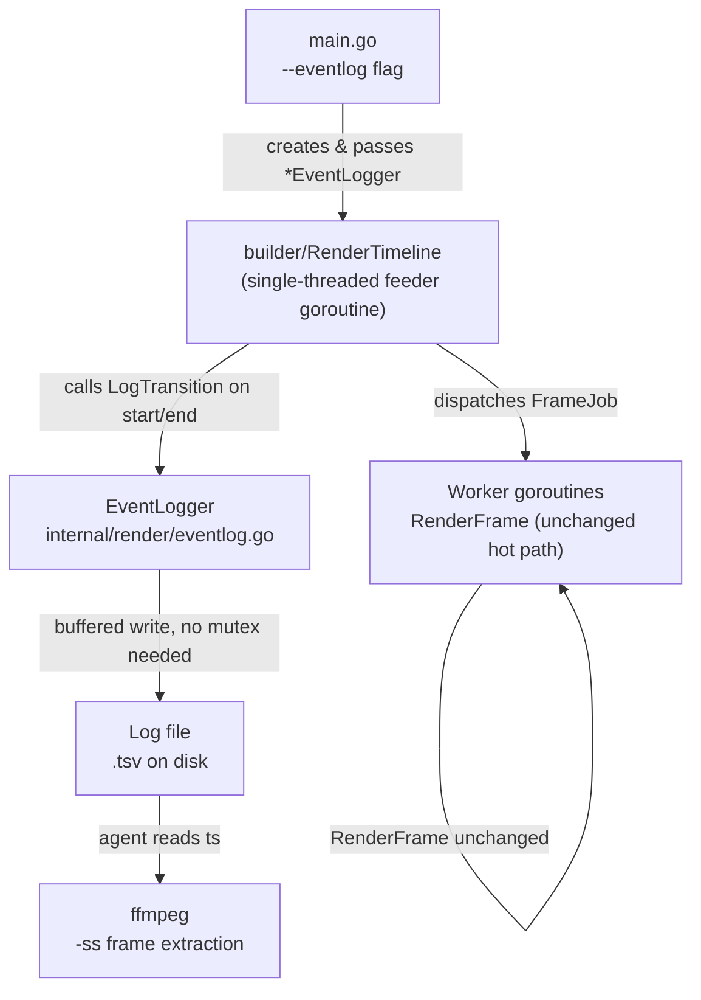
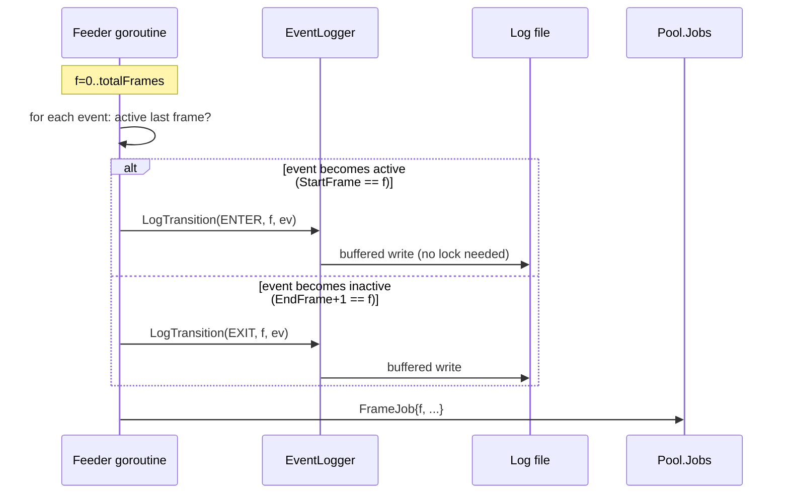

# Architecture Plan: Event Logging for RenderFrame Debug Workflow

## Summary

Adds an opt-in, zero-overhead event log to `zen-board` that records the start/end timestamps
and position of every visual event during a render. When enabled via `--eventlog <path>`, the
log produces one line per **state transition** (event start / event end) — not one per active
frame — making it suitable for scripted `ffmpeg -ss <ts> -i video.mp4 -frames:v 1 frame.png`
extraction without watching the full MP4. The log is disabled by default (nil pointer guard =
zero branch cost in the hot path) and written by the single-threaded frame feeder goroutine,
eliminating any mutex or ordering issue.

---

## System Boundaries & Component Breakdown



**Key boundary**: Logging lives in the **feeder goroutine** (single-threaded), NOT inside `RenderFrame`.
Workers and `RenderFrame` are completely untouched.

---

## Data Flow & State Management



### Transition Detection Logic (pseudocode)

```go
// Feeder goroutine in RenderTimeline
prevActive := make(map[int]bool) // keyed by event index

for f := 0; f < totalFrames; f++ {
    for i, ev := range timeline.Events {
        nowActive := f >= ev.StartFrame && f <= ev.EndFrame
        if nowActive && !prevActive[i] {
            eventLog.LogTransition("ENTER", f, ev, conf.FPS)
        }
        if !nowActive && prevActive[i] {
            eventLog.LogTransition("EXIT", f, ev, conf.FPS)
        }
        prevActive[i] = nowActive
    }
    sem <- struct{}{}
    engine.Pool.Jobs <- FrameJob{...}
}
// Flush trailing EXIT for events still active at end
for i, ev := range timeline.Events {
    if prevActive[i] {
        eventLog.LogTransition("EXIT", totalFrames-1, ev, conf.FPS)
    }
}
```

---

## New File: `internal/render/eventlog.go`

### Struct

```go
type EventLogger struct {
    w      *bufio.Writer
    f      *os.File
    broken atomic.Bool  // set on first write error; stops further writes silently
}
```

**No `enabled bool`** — nil pointer on `*EventLogger` IS the disable mechanism.

### API

```go
func NewEventLogger(path string) (*EventLogger, error)

// Nil-safe: if l == nil, no-op. Called from feeder goroutine ONLY — no mutex needed.
func (l *EventLogger) LogTransition(dir string, frame int, ev model.FrameEvent, fps int)

// Must be called even on error return from RenderTimeline (use defer in Run())
func (l *EventLogger) Close() error  // Flush() then f.Close()
```

### Log Format (TSV)

```
# zen-board eventlog v1
# dir	frame	ts_sec	event_type	target	x,y	zoom_focus
ENTER	120	4.000	draw	world	0,0	reset
EXIT	240	8.000	draw	world	0,0	reset
ENTER	241	8.033	slide	city/fade	960,0	TR
EXIT	421	14.033	slide	city/fade	960,0	TR
```

Column definitions:

| Column       | Source                                      |
|:-------------|:--------------------------------------------|
| `dir`        | `ENTER` or `EXIT`                           |
| `frame`      | `frameNum`                                  |
| `ts_sec`     | `%.3f` of `frame / fps`                     |
| `event_type` | `ev.EventType`                              |
| `target`     | enriched per event type (see table below)   |
| `x,y`        | `ev.X,ev.Y` (static event origin)           |
| `zoom_focus` | `ev.ZoomFocus` (camera region correlation)  |

File opened with `O_CREATE|O_TRUNC|O_WRONLY` — always fresh per run.

### Event-name enrichment per EventType

| EventType          | `target` field                                    |
|:-------------------|:--------------------------------------------------|
| draw/erase/static/move/text | `ev.TargetImage`                       |
| slide              | `ev.TargetImage + "/" + ev.Transition`            |
| lower3rd           | `ev.TargetImage`                                  |
| arrow/arrow_static | `ev.ArrowFrom + "→" + ev.ArrowTo`                 |
| highlight          | `ev.TargetImage + "/" + ev.HighlightStyle`        |
| compare            | `ev.CompareLeft + "|" + ev.CompareRight`          |
| overlay            | `ev.TargetImage`                                  |
| transition         | `ev.TransitionType`                               |
| counter            | `ev.CounterFormat`                                |

---

## CLI Changes (`main.go`)

```go
eventLogPath := fs.String("eventlog", "", "Path to write event transition log (TSV); empty = disabled")

// After flag parsing, before RenderTimeline:
var el *render.EventLogger
if *eventLogPath != "" {
    el, err = render.NewEventLogger(*eventLogPath)
    if err != nil {
        return fmt.Errorf("eventlog: %w", err)
    }
    defer el.Close()  // guaranteed flush even on error
}

// Updated call:
err = builder.RenderTimeline(conf, comp.Timeline, engine, pipe, comp.StyleKeyframes, pLines, *cameraEnabled, el)
```

### `RenderTimeline` signature change

```go
func RenderTimeline(..., eventLog *render.EventLogger) error
```

No other function signatures change. `RenderFrame` is **not modified**.

---

## Failure Modes & Mitigations

| Failure | Handling |
|:--------|:---------|
| `--eventlog` path unwritable | `NewEventLogger` returns error → `Run()` fails loudly before rendering begins |
| Disk full mid-render | `LogTransition` sets `broken` atomic flag on first error, prints one `stderr` warning; render continues |
| Log not flushed on render error | `defer el.Close()` in `Run()` ensures flush/close even on error return |
| Freeze frames bloat log | Transition-only logging: freeze frames produce no ENTER/EXIT — zero noise |
| Out-of-order log entries | Impossible: feeder is single-goroutine; entries written in frame order |
| Events still active at render end | Feeder emits trailing EXIT sweep after main loop |
| Nil EventLogger panics at call sites | `LogTransition` is nil-safe via `if l == nil { return }` — no per-call guard needed |

---

## Key Decisions & Alternatives Considered

### Decision 1: Log at feeder vs. inside `RenderFrame`
- **Chosen**: feeder goroutine (single-threaded)
- **Alternative rejected**: inside `RenderFrame` workers
- **Rationale**: Workers are concurrent — logging inside requires mutex, produces unordered output, and requires touching 8+ early-`continue` handler branches (slide, lower3rd, arrow, highlight, compare, overlay, transition, counter). Feeder has ordered frame knowledge; moving logging there avoids all problems at the cost of static `ev.X,ev.Y` instead of animated pixel position.

### Decision 2: Transition-based (ENTER/EXIT) vs. per-frame logging
- **Chosen**: transition-based
- **Alternative rejected**: log once per active frame
- **Rationale**: Per-frame logging produces ~90 nearly-identical lines for a 3-second event at 30fps. For `ffmpeg -ss <ts>`, only the start timestamp is needed. Transition logging reduces volume by 10-90x and makes the log human-readable.

### Decision 3: TSV vs. JSON-lines
- **Chosen**: TSV (token-efficient, grep/awk/awk friendly)
- **Alternative**: JSON-lines (self-describing, programmatically robust)
- **Rationale**: Primary consumer is a human + ffmpeg shell script. TSV is sufficient. A `--eventlog-format` flag can be added later if JSON is needed for agent tooling.

### Decision 4: Static `ev.X,ev.Y` vs. eased/animated position
- **Chosen**: static event origin
- **Alternative**: exact pixel position per frame (requires per-frame logging)
- **Rationale**: Animated position requires per-frame logging (rejected in Decision 2). Event origin is sufficient to identify *which object* and *roughly where* — all an agent needs to interpret a frame extracted via ffmpeg.

### Decision 5: `atomic.Bool broken` vs. error return from logger
- **Chosen**: atomic flag, single stderr warning, silent skip thereafter
- **Alternative**: return error from `RenderFrame` (requires signature change)
- **Rationale**: Changing `RenderFrame` to return error ripples into the worker pool and is disproportionate for a debug-only feature. Silent degradation with one warning is correct here.

---

## Red-Team Critique Summary (Claude, 2026-07-27)

| # | Critique | Resolution |
|:--|:---------|:-----------|
| 1 | **Event coverage gap** — 8 event types use `continue` before any shared logging point | **Folded in** — logging moved to feeder; problem eliminated entirely |
| 2 | **Nil-guard placement** — per-handler nil checks needed if logging is in `RenderFrame` | **Folded in** — single nil-safe `LogTransition`; no per-handler guards |
| 3 | **Out-of-order log entries** — concurrent workers produce non-reproducible log order | **Folded in** — feeder goroutine is single-threaded; log is inherently ordered |
| 4 | **Mutex contention** — per-event lock under parallel workers is needless serialization | **Folded in** — no mutex at all; feeder is single-goroutine |
| 5 | **No error path** — disk-full silently swallowed; flush not guaranteed | **Folded in** — `atomic.Bool broken` + stderr warning; `defer el.Close()` in `Run()` |
| 6 | **Freeze frames bloat log** — end-clamped events log redundantly during freeze tail | **Folded in** — transition-only logging; freeze frames produce no ENTER/EXIT |
| 7 | **Redundant `enabled bool`** — dual disable mechanism, potential data race | **Folded in** — nil pointer is sole disable mechanism; `enabled` field removed |
| 8 | **Simpler alternative: log at feeder** | **Folded in** — this is the chosen design |
| 9 | **Per-frame granularity is wrong** for the ffmpeg use case | **Folded in** — ENTER/EXIT transition-based logging adopted |
| 10 | **CLI ergonomics** — truncate vs append, unwritable path, format flag | **Folded in** — `O_TRUNC` semantics; unwritable path fails `Run()` loudly; TSV chosen; `--eventlog-format` deferred |

---

## Open Questions

> [!NOTE]
> Not blockers — confirm before implementation.

1. **[UNCERTAIN]** Does the ffmpeg extraction workflow need the *exact animated pixel position* of the hand/object at a given frame, or is static `ev.X,ev.Y` sufficient? If exact position is required, per-frame logging inside `RenderFrame` becomes necessary and the mutex/ordering complexity re-enters.
static ev.X,ev.Y origin is enough

2. **Feeder goroutine is anonymous**: The current feeder is an anonymous `go func()` in `RenderTimeline`. Passing `EventLogger` there is clean (closure capture) and requires no new types — confirm this is stable before implementation.

3. **Log consumer tooling**: Should a companion shell script (e.g., `scripts/extract-events.sh`) be part of the deliverable, or is raw TSV sufficient for the agent ffmpeg workflow?

4. **Freeze frame EXIT sentinel**: Should EXIT entries emitted at the end of the freeze tail be suppressed or included? Useful to know event was still active at render end, but adds noise if freeze is long.
