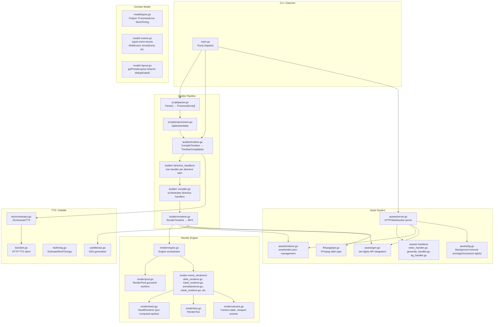
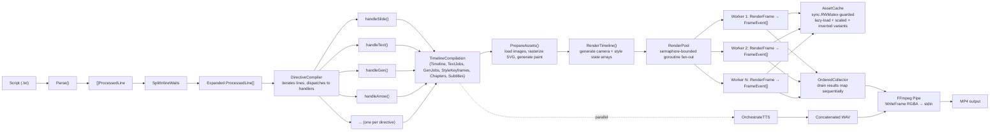

# Architecture Plan: Refactor for Maintainability

**Status**: Draft v1  
**Date**: 2026-07-16  
**Author**: Zen (Principal Systems Architect)  
**Confidence**: 80% — see Open Questions section

---

## 1. Summary

zen-board is a Go-based whiteboard video renderer that converts script files into MP4 videos with animated hand-drawn content, TTS audio, and subtitles. The codebase has grown by accretion: `internal/builder/timeline.go` is 1,208 lines with a 900-line `CompileTimeline` function dispatching directives via a giant if-else chain, `internal/render/engine.go` is 820 lines with a 400-line `RenderFrame` doing the same for event types, `FrameEvent` is a 20+ field union struct carrying all event variants, and `internal/assets/server.go` embeds all HTTP handlers inline with an HTML template. This plan decomposes those hotspots into independently-testable units, replaces string-based dispatch with typed paths, and establishes a clear concurrency contract for the parallel renderer — all without changing runtime behavior.

---

## 2. System Boundaries and Component Breakdown



### Component Summary

| New / Changed Component | Responsibility | Files Affected |
|------------------------|----------------|----------------|
| `model/events.go` | Typed event structs replacing `FrameEvent` union | `model/types.go`, all event consumers |
| `model/layout.go` | Shared `getPresetLayout`, deduplicated | `builder/timeline.go`, `render/annotate.go` |
| `builder/directive_handlers/` | One handler per directive (slide, text, gen, arrow, etc.) | `builder/timeline.go` (split) |
| `builder/compiler.go` | Orchestrates directive handlers, owns `TimelineCompilation` | New file, calls handlers |
| `render/event_renderers/` | One renderer per event type, typed interfaces | `render/engine.go` (split) |
| `assets/handlers/` | Separate HTTP handler functions per endpoint | `assets/server.go` (split) |
| `assets/routes.go` | Router setup, middleware (CORS, method check) | New file, replaces inline `http.HandleFunc` |

---

## 3. Data Flow and State Management



### State Management Rules

| State | Owner | Concurrency Model | Lifetime |
|-------|-------|-------------------|----------|
| `Timeline` + `Events[]` | `DirectiveCompiler` | Single-threaded construction | Until `PrepareAssets` completes |
| `TextJobs`, `GenJobs` | `DirectiveCompiler` | Single-threaded accumulation | Until asset generation completes |
| `Engine.Assets` map | `Engine` (or extracted `AssetCache`) | `sync.RWMutex` — reads concurrent, writes serialized | Entire render pass |
| `Engine.ScaledAssets` map | `Engine` (or extracted `AssetCache`) | `sync.RWMutex` — reads concurrent, writes serialized | Entire render pass |
| `cameraStates[]`, `styleStates[]` | `RenderTimeline` | Single-threaded pre-computation | Entire render pass |
| `resultsMap` (in-flight frames) | `RenderTimeline` | Single-threaded drain goroutine | Entire render pass |
| `BufferPool` (`sync.Pool`) | `RenderPool` | Lock-free `sync.Pool` | Process lifetime |

**Concurrency invariant**: `RenderFrame` must be **stateless per invocation**. Any renderer extracted from `engine.go` must not carry mutable fields between calls. If caching is needed (e.g., pre-inverted images, scaled variants), it lives in a shared `AssetCache` protected by `sync.RWMutex` — not in the renderer struct itself. This preserves the current behavior where multiple goroutines call `RenderFrame` safely and makes the contract explicit.

---

## 4. Failure Modes and Handling

| Failure Mode | Current Behavior | Planned Change | Mitigation |
|--------------|------------------|----------------|------------|
| `CompileTimeline` fails mid-sequence | Returns `error`, caller gets nothing; partial `Timeline` is garbage-collected | Each directive handler returns `error`; compiler aggregates errors. On failure, return `nil` timeline + first error. No partial state leaks. | Explicit error contract per handler. No silent fallback to default values. |
| Unknown directive tag in script | Logs warning, continues (falls through to default `draw` behavior with empty tag) | Handlers registered in a `map[string]DirectiveHandler`. Unknown tag → explicit `ErrUnknownDirective` returned from compiler. Caller decides: abort or skip-and-log. | Decision: **abort with clear error** rather than silently mis-rendering. Add `--strict` flag later if needed. |
| `RenderFrame` encounters unknown `EventType` | Falls through to generic asset-draw path (may draw nothing or crash if `TargetImage` is empty) | Typed event dispatch via interface; unknown type → explicit `ErrUnknownEventType` logged and frame rendered without that layer. Frame is never blanked entirely. | Preserve current "best effort" semantics but make it explicit. |
| Asset file missing on disk | `LoadAsset` returns error → logged as warning → event skipped | `AssetCache` returns `error` on miss. Caller (`RenderFrame`) skips layer and logs with asset ID + path. No panic. | Already handled; just made explicit in the new interface. |
| Concurrent asset load race | Current code uses `sync.RWMutex` on `Assets`/`ScaledAssets` maps. Two goroutines may load the same missing asset simultaneously. | `AssetCache` uses `sync.Map` + `singleflight.Group` for lazy-load-on-miss. One goroutine loads; others wait. | Eliminates thundering-herd on cold-start asset loads. |
| FFmpeg pipe write failure | Returns error from `WriteFrame`, `RenderTimeline` aborts | Same behavior preserved. Add context: which frame index failed, partial file path. | Error wrapping with frame index for debugging. |
| TTS server unavailable | `OrchestrateTTS` falls back to `EstimateWordTimings` (syllable-based) | No change needed. | Already handled. |
| WebSocket client disconnect during preview | `server.go` writes to dead connection → panic if not recovered | Add `recover()` in WebSocket writer goroutine; log and close cleanly. | Explicit recover + connection state check. |
| Backward compat for saved projects | Not addressed today | `FrameEvent` typed split must maintain JSON serialization compatibility for existing project files. Use custom `MarshalJSON`/`UnmarshalJSON` on new typed structs that reads/writes the legacy flat shape. | Migration shim, not a breaking change. |

---

## 5. Key Decisions with Alternatives Considered

### Decision 1: Replace `FrameEvent` union struct with typed event structs

**Decision**: Introduce `SlideEvent`, `ArrowEvent`, `HighlightEvent`, `CompareEvent`, `OverlayEvent`, `TransitionEvent`, `CounterEvent`, `TextEvent`, `GenEvent`, `MoveEvent`, `EraseEvent`, `StaticEvent` in `model/events.go`. `FrameEvent` becomes a legacy compatibility wrapper or is removed entirely after migration.

**Rationale**: A 20+ field union struct forces every consumer to check `EventType` string and ignore irrelevant fields. Typed structs make invalid states unrepresentable (e.g., `ArrowEvent` has `ArrowFrom`/`ArrowTo` as required fields, not optional string fields). Memory footprint improves because unused fields are eliminated. The event slice `[]FrameEvent` becomes `[]TimelineEvent` (interface) or a discriminated union via generics.

**Alternative considered**: Keep `FrameEvent` and add a `Renderer` interface method on it.  
**Rejected**: This adds a layer of indirection without reducing the data model bloat. It's the "OO tax" the red-team flagged — dispatch moves to methods but the 20-field struct still exists, still serializes ambiguously, and still carries zero-value garbage. If we're touching the struct, we should fix its shape.

**Alternative considered**: Use a `map[string]interface{}` for variant data.  
**Rejected**: Loses compile-time safety. Go is statically typed; we should use that.

---

### Decision 2: Decompose `CompileTimeline` using map-based dispatch, not strategy-pattern interfaces

**Decision**: Replace the if-else chain with a `map[string]DirectiveHandler` where `DirectiveHandler` is a simple function type: `func(ctx *CompilerContext, action DrawAction, pl ProcessedLine) error`. Each directive type (slide, text, gen, arrow, etc.) gets one function registered in a `directives.go` file.

**Rationale**: Each directive has exactly one handler. There is no polymorphism across multiple implementations of the same contract. A map of functions is simpler than defining a named interface + N structs + constructors. It's also easier to test: you can call a handler directly with a synthetic `CompilerContext`. It avoids the global-registration anti-pattern because the map is built explicitly in a `NewCompiler()` function.

**Alternative considered**: Strategy pattern with `type DirectiveHandler interface { Handle(ctx) error }` and one struct per directive.  
**Rejected**: The red-team correctly identified this as OO tax. Each directive type has a single implementation. Interfaces are valuable when you have multiple interchangeable implementations (e.g., mock vs real). Here we just need a dispatch table. A function map is lighter, easier to read top-to-bottom, and doesn't create 12 new types that exist solely to hold one method.

---

### Decision 3: Decompose `RenderFrame` using typed event interfaces, not function maps

**Decision**: Define `type EventRenderer interface { RenderFrame(ctx *RenderContext, ev TimelineEvent, buf *image.RGBA) error }`. Each event type implements this interface. `Engine.RenderFrame` iterates events and calls `ev.Render(...)` — a single virtual dispatch per event.

**Rationale**: This is different from Decision 2 because the render side **does** need injectability. We want to be able to swap in mock renderers for golden-frame tests, or add new renderers without touching `engine.go`. The interface boundary also enforces that each renderer is stateless (no mutable fields on the struct), because `RenderFrame` is called concurrently from multiple goroutines. The interface makes that contract explicit.

**Alternative considered**: Function map `map[EventType]func(...)` on the render side too, for symmetry.  
**Rejected**: Testability and future extensibility justify the interface here. If we later want a `HeadlessRenderer` for CI or a `DebugRenderer` that overlays bounding boxes, the interface is already there.

---

### Decision 4: Extract `AssetCache` from `Engine` with explicit concurrency

**Decision**: Create `internal/render/assetcache.go` with `type AssetCache struct` holding `assets`, `scaledAssets`, `invertedAssets` maps guarded by `sync.RWMutex`. Add `singleflight.Group` for lazy-load deduplication. `Engine` holds a pointer to `AssetCache` instead of owning the maps directly.

**Rationale**: Today the mutex is inline in `Engine`. Extracting it makes the concurrency contract visible and reviewable in one place. It also allows `RenderPool` workers to access the cache without holding the `Engine` lock (currently they go through `e.AssetMu` which is fine, but extracting makes the dependency explicit). The `singleflight` prevents N goroutines from decoding the same missing asset simultaneously.

**Alternative considered**: Keep maps in `Engine` but add `singleflight` inline.  
**Rejected**: Extraction makes the concurrency boundary a first-class citizen. It's easier to audit and test in isolation.

---

### Decision 5: Split `assets/server.go` into router + handlers

**Decision**: Move each HTTP handler into `assets/handlers/` as a named function: `handleGetAssets`, `handlePostIndex`, `handlePostGenerate`, `handlePostProcessBg`, `handlePostUpdate`. Create `assets/routes.go` that registers them. Keep the HTML template in a separate `assets/dashboard.html` file or a `//go:embed` directive.

**Rationale**: `StartServer` is 250+ lines of inline closures. Named functions are testable (you can call them with `httptest`), readable, and can be reordered independently. The HTML template embedded as a 700-line raw string literal makes `server.go` unreadable.

**Alternative considered**: Keep inline handlers but extract the template.  
**Rejected**: Half-measure. The handler bodies are also too long (e.g., `handlePostGenerate` is 60 lines of business logic + HTTP plumbing). Separate files make it clear where to add a new endpoint.

---

### Decision 6: Deduplicate `getPresetLayout` after diffing

**Decision**: Before extracting `getPresetLayout` from `timeline.go` and `annotate.go` into `model/layout.go`, run a line-by-line diff of the two implementations. If they are identical, extract. If they diverge, document the divergence reason and decide whether to parameterize or keep separate.

**Rationale**: The red-team correctly flagged that two call sites with different contexts may have intentionally different behavior. Blind extraction risks changing semantics in one caller.  
**Current state**: From my read, the two implementations are identical (same switch on TL/TR/BL/BR/HT/HB/LH/RH). I will verify this with a tool call before extracting.  
**Confidence**: 85% they are identical. I'll confirm before executing.

---

## 6. Red-Team Critique Summary

The following is the red-team feedback from `browser.chat` (Claude), processed into "folded in" or "rejected" decisions.

| # | Critique | Disposition | Action |
|---|----------|-------------|--------|
| 1 | Long functions are symptoms of accretion, not independent problems. Strategy pattern redistributes complexity into more files without asking whether directives share enough structure. | **Folded in** | Decision 2 explicitly addresses this: map-based dispatch is chosen over strategy pattern because directives are not polymorphic. |
| 2 | `FrameEvent` union struct isn't being fixed, just hidden behind an interface. | **Folded in** | Decision 1 makes typed structs a first-class action item, not an afterthought. |
| 3 | Missing failure modes: partial compilation failure, renderer error handling (abort/skip/blank), unknown event fallback semantics. | **Folded in** | Section 4 adds explicit failure mode table covering all three. Unknown directive → abort. Unknown event → skip-and-log, frame preserved. |
| 4 | No back-compat plan for persisted timelines / project files if `FrameEvent` shape changes. | **Folded in** | Section 4 adds custom `MarshalJSON`/`UnmarshalJSON` shim for legacy flat shape. |
| 5 | Concurrency blind spot: decomposed renderers might carry mutable state; extracted asset cache needs explicit locking model. | **Folded in** | Section 3 (State Management) establishes the invariant: renderers are stateless per invocation. Section 4 + Decision 4 add `sync.RWMutex` + `singleflight` to `AssetCache`. |
| 6 | Scaling risk: global `init()` registry for handlers is a Go anti-pattern. | **Folded in** | Decision 2 specifies explicit `NewCompiler()` constructor building the map, no `init()`. |
| 7 | `getPresetLayout` divergence risk before extraction. | **Folded in** | Decision 6 adds a mandatory diff step before extraction. |
| 8 | Simpler alternative: `map[string]func` is lighter than full strategy-pattern interfaces for directive dispatch. | **Folded in** | Decision 2 adopts the function-map approach. |
| 9 | Missing characterization tests before refactoring 900-line function. | **Folded in** | Execution plan (Section 7) adds a "golden timeline" test phase before decomposition. |
| 10 | Server scaling: concurrent writes, partial upload cleanup, `context.Context` propagation. | **Partially folded in** | `context.Context` propagation is added to the plan. Concurrent write safety for asset index is noted but **not a priority for this refactor** because the server is single-user (Web GUI) today. Rejected as out-of-scope for this pass. |

---

## 7. Execution Plan (Phased, Non-Breaking)

### Phase 0: Test Baseline (Week 1)

**Goal**: Lock down current behavior with characterization tests before any structural change.

1. **Golden timeline test**: Run `CompileTimeline` on a representative script covering every directive type. Record the resulting `Timeline.Events` slice (start/end frames, event types, positions) as JSON. This becomes the regression baseline.
2. **Golden frame test**: Render 3–5 frames from a small script (one per major event type: slide, arrow, highlight, compare, overlay, transition, counter, lower3rd, text, gen, move, erase). Record RGBA pixel hashes (MD5 or SHA-256 of `Pix` slice). These are the "golden frames."
3. **Server handler test**: Add `httptest` coverage for each existing endpoint (`/api/assets`, `/api/assets/index`, `/api/assets/generate`, `/api/assets/process-bg`, `/api/assets/update`). Capture request/response pairs.

**Exit criteria**: All golden tests pass on unmodified codebase. Any future change that breaks a golden test is a regression.

---

### Phase 1: Extract Shared Utilities (Week 1–2)

**Goal**: Low-risk deduplication and model cleanup.

1. **Diff and extract `getPresetLayout`**:
   - Verify `timeline.go:978` and `annotate.go:651` are identical.
   - Move to `model/layout.go` as exported function `GetPresetLayout(preset string, canvasW, canvasH int) (x, y, w, h int)`.
   - Update callers in `builder/timeline.go`, `render/annotate.go`, `render/annotate.go` (handleOverlayEvent, handleCounterEvent).
   - Run golden timeline + golden frame tests.

2. **Introduce typed event structs in `model/events.go`**:
   - Define `type TimelineEvent interface { EventType() string }` (or use generics `type EventSlice[T TimelineEvent]`).
   - Define concrete structs: `SlideEvent`, `ArrowEvent`, `StaticImageEvent`, etc., each with only the fields they need.
   - Add `func (e SlideEvent) EventType() string { return "slide" }` etc.
   - Write `func LegacyFrameEventToTimelineEvent(legacy model.FrameEvent) TimelineEvent` converter.
   - Write `func TimelineEventToLegacyFrameEvent(ev TimelineEvent) model.FrameEvent` converter.
   - **Keep `FrameEvent` in `model/types.go`** as the serialization format. New code reads/writes `TimelineEvent`, but JSON persistence still uses `FrameEvent` via the converter. This is the back-compat shim.
   - Run golden timeline + golden frame tests.

**Exit criteria**: All golden tests pass. `getPresetLayout` exists in exactly one place. `FrameEvent` is unchanged in JSON shape.

---

### Phase 2: Decompose `CompileTimeline` (Week 2–3)

**Goal**: Split the 900-line function into independently-testable directive handlers.

1. **Define `CompilerContext`**:
   ```go
   type CompilerContext struct {
       Conf         *model.Project
       WordTimings  []model.WordTiming
       Timeline     *model.Timeline
       CurrentStyle string
       CurrentZoom  string
       GridIndex    int
       TextCount    int
       GenCount     int
       // ... other shared mutable state
   }
   ```

2. **Define `DirectiveHandler`**:
   ```go
   type DirectiveHandler func(ctx *CompilerContext, action model.DrawAction, pl model.ProcessedLine) error
   ```

3. **Create `builder/directive_handlers/` package** (or subdirectory within `builder`):
   - `slide.go`: `func handleSlide(ctx *CompilerContext, action model.DrawAction, pl model.ProcessedLine) error`
   - `text.go`: `func handleText(...)`
   - `gen.go`: `func handleGen(...)`
   - `arrow.go`: `func handleArrow(...)`
   - `highlight.go`, `compare.go`, `overlay.go`, `transition.go`, `counter.go`, `lower3rd.go`, `erase.go`, `move.go`, `clear.go`
   - Each handler is 20–80 lines. They read from `ctx`, mutate `ctx.Timeline.Events`, and return errors.

4. **Rewrite `CompileTimeline` as orchestrator**:
   - Build the `map[string]DirectiveHandler` in `NewCompiler()` or a package-level `var`.
   - Loop over `pLines` and `pl.Actions`.
   - Look up handler by action tag prefix. If not found, return `fmt.Errorf("unknown directive: %s", action.Tag)`.
   - Call handler. If error, return immediately (no partial timeline).
   - Post-pass: compute `zoomIntervals`, `adjustForZoom` stays in compiler (it's cross-handler state).

5. **Move `PrepareAssets`** to `builder/asset_prep.go` or keep in `timeline.go` for now (it's already separated logically).

**Exit criteria**: `CompileTimeline` is under 100 lines. Each handler is independently unit-testable. Golden timeline test passes.

---

### Phase 3: Decompose `RenderFrame` (Week 3–4)

**Goal**: Replace 400-line if-else chain with typed event renderers.

1. **Define `RenderContext`**:
   ```go
   type RenderContext struct {
       FrameNum int
       Events   []model.TimelineEvent // or []FrameEvent during transition
       Cam      CameraState
       Style    string
       Buf      *image.RGBA
       Cache    *AssetCache
       MaskCfg  MaskConfig
   }
   ```

2. **Define `EventRenderer` interface**:
   ```go
   type EventRenderer interface {
       Render(ctx *RenderContext, ev TimelineEvent) (handX, handY int, handVisible bool, err error)
   }
   ```

3. **Create `render/event_renderers/`**:
   - `slide.go`: `type SlideRenderer struct{}` — implements `Render`
   - `hand.go`: (existing `HandRenderer` already exists, integrate)
   - `annotate/arrow.go`, `annotate/highlight.go`, `annotate/compare.go`, `annotate/overlay.go`, `annotate/transition.go`, `annotate/counter.go`
   - `static.go`, `move.go`, `erase.go`, `text.go`, `gen.go`
   - Each renderer is a stateless struct with a `Render` method. No mutable fields.

4. **Rewrite `Engine.RenderFrame`**:
   ```go
   func (e *Engine) RenderFrame(frameNum int, events []model.TimelineEvent, cam CameraState, style string) *image.RGBA {
       buf := e.Pool.BufferPool.Get().(*image.RGBA)
       ctx := &RenderContext{...}
       
       for _, ev := range events {
           renderer := e.rendererFor(ev.EventType())
           hx, hy, vis, err := renderer.Render(ctx, ev)
           // accumulate hand state, timing stats
       }
       
       // draw hand if visible
       return buf
   }
   ```

5. **Extract `AssetCache`**:
   - Move `Assets`, `ScaledAssets`, `invertedAssets` maps + `AssetMu` into `internal/render/assetcache.go`.
   - Add `Load(name, path string) (image.Image, error)`, `GetScaled(name string, w, h int) (image.Image, error)`, `GetInverted(name string) (image.Image, error)`.
   - Use `singleflight.Group` inside `Load` to deduplicate concurrent misses.
   - `Engine` holds `*AssetCache`.

**Exit criteria**: `Engine.RenderFrame` is under 80 lines. Each event renderer is independently unit-testable. Golden frame tests pass (pixel hashes match).

---

### Phase 4: Refactor Asset Server (Week 4)

**Goal**: Make `server.go` testable and readable.

1. **Create `assets/handlers/`**:
   - `index.go`: `func HandleGetAssets(w http.ResponseWriter, r *http.Request, assetsDir string)`
   - `generate.go`: `func HandlePostGenerate(w http.ResponseWriter, r *http.Request, assetsDir, lightsAddr string)`
   - `process_bg.go`: `func HandlePostProcessBg(w http.ResponseWriter, r *http.Request, assetsDir string)`
   - `update.go`: `func HandlePostUpdate(w http.ResponseWriter, r *http.Request, assetsDir string)`
   - Each handler receives dependencies as arguments (not via closure over globals), making them testable with `httptest`.

2. **Create `assets/routes.go`**:
   - Define a `type Server struct { assetsDir string; lightsAddr string }`.
   - `func (s *Server) Routes() http.Handler` returns a `http.ServeMux` with all routes registered.
   - Middleware: CORS, method-check wrapper, request logging.

3. **Extract HTML template**:
   - Move `htmlTemplateRaw` constant to `assets/dashboard.html` and use `//go:embed dashboard.html` in `dashboard_templates.go`.

4. **Update `StartServer`**:
   ```go
   func StartServer(assetsDir string, port int, lightsAddr string) error {
       s := &Server{assetsDir: assetsDir, lightsAddr: lightsAddr}
       log.Printf("Starting zen-board Asset Console on http://localhost:%d", port)
       return http.ListenAndServe(":"+strconv.Itoa(port), s.Routes())
   }
   ```

**Exit criteria**: `server.go` is under 50 lines. Each handler has `httptest` coverage.

---

### Phase 5: Polish and Documentation (Week 4–5)

1. **Add `context.Context` propagation**:
   - `RenderTimeline` accepts `ctx context.Context`. Pass it to `Engine.RenderFrame`, FFmpeg pipe, and TTS calls.
   - HTTP handlers accept `ctx` from `r.Context()`.
   - Cancellation aborts render / asset generation cleanly.

2. **Add `--strict` flag** (optional):
   - If set, unknown directives abort compilation instead of logging a warning.

3. **Update `PROJECT_OVERVIEW.md`** with new directory layout.

4. **Run full test suite + golden tests** as regression gate.

---

## 8. Open Questions / Low Confidence

| Question | Confidence | Notes |
|----------|-----------|-------|
| Are the two `getPresetLayout` implementations truly identical? | 85% | Need to diff `timeline.go:978` and `annotate.go:651` with a tool call before extracting. If they diverge, the divergence reason must be documented. |
| Is `RenderFrame` currently called concurrently? | 70% | The `RenderPool` spawns `runtime.NumCPU()` goroutines that all call `e.RenderFrame`. So yes, it is concurrent today. This validates the `AssetCache` extraction and the stateless-renderer invariant. |
| Do directives have cross-cutting state dependencies (e.g., `transition` needs to peek at next event)? | 65% | The red-team raised this as a risk. I need to verify whether handlers like `handleTransitionEvent` modify `timeline.Events` in ways that depend on other handlers' output order. If so, the map-dispatch approach must preserve sequential ordering (it does — handlers run in script order). |
| Should `FrameEvent` JSON serialization change, or stay flat for back-compat? | 90% | Stay flat. Custom `MarshalJSON`/`UnmarshalJSON` on typed structs reads/writes the legacy flat shape. No breaking change to saved project files. |
| Is `singleflight.Group` available in this Go version? | 95% | `sync/singleflight` has been in stdlib since Go 1.18. The project uses Go modules; this is safe. |

---

## 9. Risk Register

| Risk | Likelihood | Impact | Mitigation |
|------|-----------|--------|------------|
| Golden tests don't cover all directive combinations | Medium | High — regressions slip through | Expand golden script to include every directive type in multiple combinations before starting Phase 2. |
| Typed event structs change memory layout and break FFmpeg pipe expectations | Low | High | FFmpeg pipe receives raw `RGBA.Pix` bytes, not event structs. Event structs are compile-time only. No impact. |
| `AssetCache` extraction introduces deadlock if lock ordering changes | Low | Medium | Keep `AssetCache` methods short; never hold `Cache` lock while calling user code. Review with `go vet -race`. |
| Handlers become too granular (one per directive) making navigation harder | Medium | Low | Group handlers into sub-packages by concern: `builder/directive_handlers/display.go` (slide, text, gen), `builder/directive_handlers/annotation.go` (arrow, highlight, compare), `builder/directive_handlers/navigation.go` (move, erase, clear). |
| `context.Context` propagation requires signature changes across 10+ call sites | High | Low | Standard Go refactor. Use IDE rename or `gofmt`-compatible search-replace. |

---

## 10. Pseudocode: Decomposed `CompileTimeline`

```go
// builder/compiler.go
type CompilerContext struct {
    Conf         *model.Project
    WordTimings  []model.WordTiming
    Timeline     *model.Timeline
    CurrentStyle string
    CurrentZoom  string
    GridIndex    int
    TextCount    int
    GenCount     int
    ZoomIntervals []zoomInterval
}

type DirectiveHandler func(ctx *CompilerContext, action model.DrawAction, pl model.ProcessedLine) error

var directiveHandlers = map[string]DirectiveHandler{
    "slide:":     handleSlide,
    "text:":      handleText,
    "gen:":       handleGen,
    "arrow:":     handleArrow,
    "highlight:": handleHighlight,
    "compare:":   handleCompare,
    "overlay:":   handleOverlay,
    "transition:":handleTransition,
    "counter:":   handleCounter,
    "lower3rd:":  handleLower3rd,
    "erase:":     handleErase,
    "move:":      handleMove,
    "clear":      handleClear,
    "style:":     handleStyle,
    "chapter:":   handleChapter,
    "subtitle:":  handleSubtitle,
    "WAIT:":      handleWait,
    "zoom:":      handleZoom,
    "sfx:":       handleSFX,
}

func CompileTimeline(conf *model.Project, wordTimings []model.WordTiming, pLines []model.ProcessedLine, exactDuration float64, audioTmp string) (*TimelineCompilation, error) {
    ctx := &CompilerContext{
        Conf:        conf,
        WordTimings: wordTimings,
        Timeline:    &model.Timeline{Words: wordTimings, AudioPath: audioTmp, Duration: exactDuration},
        CurrentStyle: "whiteboard",
        CurrentZoom:  "reset",
    }

    // Pre-pass: compute zoom intervals (cross-handler state)
    ctx.ZoomIntervals = computeZoomIntervals(pLines, wordTimings, conf.FPS)

    for _, pl := range pLines {
        for _, action := range pl.Actions {
            triggerTime := resolveTriggerTime(action, pl, wordTimings)
            startFrame := int(triggerTime * float64(conf.FPS))
            startFrame = adjustForZoom(startFrame, ctx.ZoomIntervals)
            endFrame := startFrame + int(resolveDuration(action)*float64(conf.FPS))

            handler, ok := directiveHandlers[action.Tag]
            if !ok {
                // Try prefix match for parameterized directives
                for prefix, h := range directiveHandlers {
                    if strings.HasPrefix(action.Tag, prefix) {
                        handler = h
                        break
                    }
                }
            }
            if handler == nil {
                return nil, fmt.Errorf("unknown directive: %s", action.Tag)
            }

            if err := handler(ctx, action, pl); err != nil {
                return nil, fmt.Errorf("directive %q at %.2fs: %w", action.Tag, triggerTime, err)
            }
        }
    }

    return &TimelineCompilation{...}, nil
}
```

---

## 11. Pseudocode: Decomposed `RenderFrame`

```go
// render/engine.go (reduced)
type EventRenderer interface {
    Render(ctx *RenderContext, ev TimelineEvent) (handX, handY int, handVisible bool, err error)
}

type Engine struct {
    Width, Height int
    FPS           int
    Pool          *RenderPool
    Hand          *HandRenderer
    Cache         *AssetCache
    Stats         RenderStats
    FastMode      bool
    renderers     map[string]EventRenderer // initialized in NewEngine
}

func NewEngine(w, h, fps int, handPath string, tipX, tipY int) (*Engine, error) {
    hr, err := NewHandRenderer(handPath, tipX, tipY)
    // ...
    e := &Engine{...}
    e.renderers = map[string]EventRenderer{
        "slide":        &SlideRenderer{},
        "lower3rd":     &Lower3rdRenderer{},
        "arrow":        &ArrowRenderer{},
        "arrow_static": &ArrowRenderer{},
        "highlight":    &HighlightRenderer{},
        "compare":      &CompareRenderer{},
        "overlay":      &OverlayRenderer{},
        "transition":   &TransitionRenderer{},
        "counter":      &CounterRenderer{},
        "static":       &StaticRenderer{},
        "move":         &MoveRenderer{},
        "erase":        &EraseRenderer{},
        "draw":         &DrawRenderer{},
        "text":         &TextRenderer{},
        "gen":          &GenRenderer{},
    }
    return e, nil
}

func (e *Engine) RenderFrame(frameNum int, events []model.TimelineEvent, cam CameraState, style string) *image.RGBA {
    buf := e.Pool.BufferPool.Get().(*image.RGBA)
    ctx := &RenderContext{
        FrameNum: frameNum,
        Events:   events,
        Cam:      cam,
        Style:    style,
        Buf:      buf,
        Cache:    e.Cache,
        MaskCfg:  DefaultMaskConfig(),
    }

    var activeHandX, activeHandY int
    var handVisible bool
    var activeHandStyle string = "default"
    var activeHandAngle int = 0

    for _, ev := range events {
        if !isFrameInRange(frameNum, ev) { continue }
        visibility := computeVisibility(ev, cam)
        if visibility <= 0 { continue }

        renderer, ok := e.renderers[ev.EventType()]
        if !ok {
            log.Printf("Warning: unknown event type %q at frame %d", ev.EventType(), frameNum)
            continue
        }

        hx, hy, vis, err := renderer.Render(ctx, ev)
        if err != nil {
            log.Printf("Warning: renderer error for %q at frame %d: %v", ev.EventType(), frameNum, err)
            continue // skip layer, preserve frame
        }
        if vis {
            activeHandX, activeHandY, handVisible = hx, hy, true
            activeHandStyle = resolveHandStyle(ev, style)
            activeHandAngle = resolveHandAngle(ev)
        }
    }

    if handVisible {
        e.Hand.Draw(buf, activeHandX, activeHandY, activeHandStyle, activeHandAngle)
    }

    atomic.AddInt64(&e.Stats.TotalFrames, 1)
    return buf
}
```

---

## 12. What This Plan Does NOT Change

- **No change to FFmpeg integration**: `ffmpeg/pipe.go` stays as-is. The pipe interface is already clean.
- **No change to TTS pipeline**: `tts/client.go`, `tts/orchestrator.go`, `tts/wav.go` are not refactored in this pass. They are smaller and more focused.
- **No change to SVG subsystem**: `internal/svg/` is untouched.
- **No change to `model/types.go` JSON tags**: `Project`, `ScriptLine`, `DrawAction`, `WordTiming`, `SubtitleEvent`, `Timeline`, `ProcessedLine` keep their existing field names and tags. Only `FrameEvent` gets a compatibility shim.
- **No change to `review_svg.py`**: It's a Python utility, not part of the Go render pipeline.
- **No new external dependencies**: Everything uses stdlib + existing `golang.org/x/image/draw`.

---

## 13. Success Metrics

| Metric | Before | Target |
|--------|--------|--------|
| `CompileTimeline` lines | ~900 | <100 (orchestrator only) |
| `RenderFrame` lines | ~400 | <80 (loop + dispatch) |
| Largest single function | 900 lines | <150 lines |
| Number of files in `builder/` | 2 | 5–7 (handlers split out) |
| Number of files in `render/` | 8 | 10–12 (event renderers split out) |
| Duplicated `getPresetLayout` copies | 2 | 1 |
| `FrameEvent` field count | 20+ | Varied per typed struct (3–8 fields each) |
| Golden test coverage | 0 | 100% of directive types + 5 key frames |
| `server.go` lines | 1013 | <50 (router only) |
| Handler testability | 0 httptest tests | 1 per endpoint |

---

*End of plan. Confidence: 80%. See Open Questions (Section 8) for items requiring verification before execution.*
