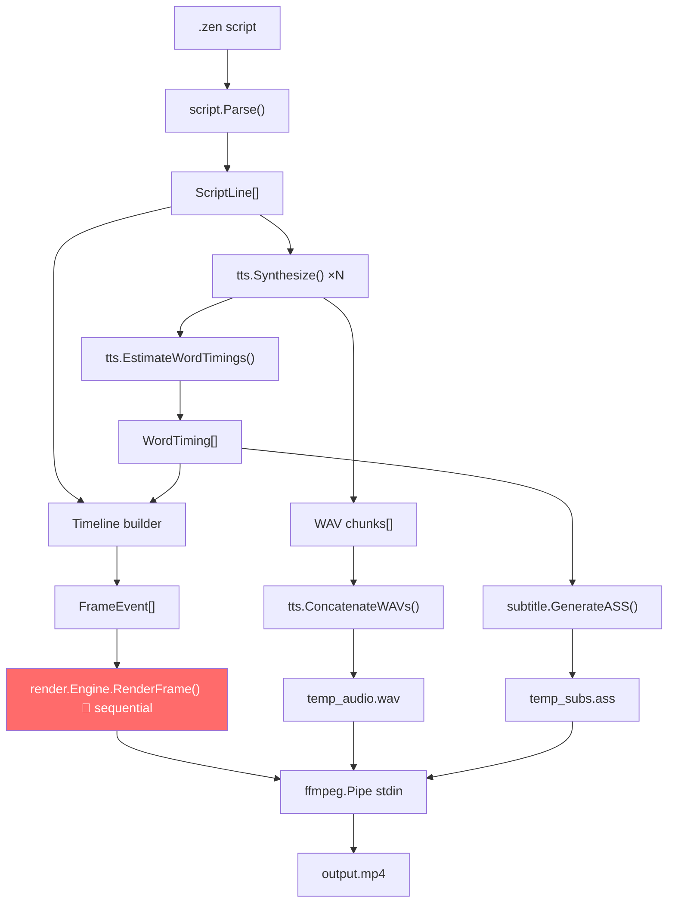

# zen-board — Code Review

> **Scope**: All 13 indexed Go files across `cmd/`, `internal/{model,script,render,tts,subtitle,ffmpeg}/`  
> **Date**: 2026-05-11 · Reviewer: Antigravity (READ-ONLY)

---

## Executive Summary

The foundation is solid: clean package boundaries, a working FFmpeg pipe, a regex-based DSL parser, and an alpha-mask reveal system with hand tracking. The biggest risks are **data-corruption bugs** in the pipeline wiring (`main.go`) and a **render bottleneck** — the `RenderPool` is scaffolded but not wired, so all frames render sequentially on a single goroutine. Address the critical section first; the enhancement roadmap is then straightforward.

---

## 🔴 Critical — Must Fix

### 1. Temp files collide in parallel runs (`main.go:133,204`)

```go
tts.SaveWAV("temp_audio.wav", finalAudio)      // line 133
os.WriteFile("temp_subs.ass", []byte(assData)) // line 204
```

Both paths are CWD-relative with fixed names. Two concurrent invocations will corrupt each other's files. Additionally, `defer os.Remove` only runs on normal exit — a `log.Fatalf` in between leaks the files permanently.

**Fix**: Use `os.CreateTemp("", "zen-audio-*.wav")` and `os.CreateTemp("", "zen-subs-*.ass")`, capture the path, and always clean up with `defer os.Remove(f.Name())` _immediately_ after `CreateTemp`.

---

### 2. WAV parser assumes a fixed 44-byte header (`wav.go:29`, `client.go:60`)

```go
dataSize := binary.LittleEndian.Uint32(data[40:44])  // wav.go
header = make([]byte, 44)                             // client.go
```

PCM WAVs with an `INFO` or `LIST` chunk have headers > 44 bytes. Reading `data[40:44]` then gives the wrong `dataSize`, producing a wrong duration and therefore wrong word timings. The `ConcatenateWAVs` function copies `chunk[44:]` as PCM — it will include extra header bytes as audio noise for non-standard WAVs.

**Fix**: Walk chunks scanning for the `"data"` FourCC tag rather than assuming a fixed offset.

---

### 3. WAIT-only lines are double-processed (`main.go:100-110` and `150-158`)

The TTS loop and the timeline-building loop both iterate over all `lines` and handle `WAIT` actions. A line that is `""` (pure wait) is `continue`d in TTS but its wait duration is accumulated into `currentTime`. In the timeline loop, the same `lineTimeOffset` accumulation happens again — but `wordOffset` is not incremented, so the subsequent `triggerWordIdx` calculation can silently reference the wrong word.

**Fix**: Pre-compute a `[]lineInfo{text, duration, wordOffset, timeOffset}` slice in the TTS pass and consume it directly in the timeline pass. Eliminate the dual `strings.HasPrefix(action.Tag, "WAIT:")` pattern.

---

### 4. OOB risk in timeline word-index mapping (`main.go:169-171`)

```go
triggerWordIdx := wordOffset + action.WordIndex - 1
if triggerWordIdx < 0 { triggerWordIdx = 0 }
if triggerWordIdx >= len(allWordTimings) { triggerWordIdx = len(allWordTimings) - 1 }
```

Silently clamping to the last word when `WordIndex` is out of range means a mistyped `[draw:tag]` position will produce a draw event at the wrong time with no warning. A `log.Printf` at minimum is warranted; ideally, validate during the parse phase.

---

## 🟠 Correctness — Should Fix

### 5. `Timeline` struct is defined but never used (`model/types.go:51-56`)

The orchestration in `main.go` uses raw `[]FrameEvent` and `[]WordTiming` slices. `Timeline` exists as a planned aggregator but is never instantiated. Either wire it in (better) or remove it to avoid confusion.

---

### 6. `FrameEvent.X/Y` and `Width/Height` hardcoded to `100, 100 / 0, 0` (`main.go:184-185`)

```go
X: 100,  // TODO: Smart positioning or from tag
Y: 100,
```

Every image renders at the same canvas position; multiple draw events overlap. `FrameEvent.Width/Height` is never set either, so the engine uses the raw asset dimensions without any scaling. This is the single biggest visual correctness gap.

---

### 7. `RenderPool` is scaffolded but unused — rendering is fully sequential

`pool.go` creates channels (`Jobs`, `Results`) and a `BufferPool` — but no goroutines are ever launched to consume `Jobs`. The engine calls `RenderFrame` synchronously in a for-loop. The `BufferPool` is used correctly for buffer recycling, but the parallel path is dead code.

> [!WARNING]
> At 30 fps × 1920×1080 RGBA = **~248 MB/s** of raw pixel data through a single goroutine. This will be the render bottleneck for any script longer than ~30 seconds.

---

### 8. `GenerateASS` hardcodes `PlayResX: 1920` / `PlayResY: 1080` (`ass.go:15-16`)

The canvas resolution is a runtime parameter (`conf.Width/Height`), but the subtitle generator ignores it. Subtitles will be misaligned if the project is rendered at any non-1080p resolution.

**Fix**: Pass `width, height int` into `GenerateASS`.

---

### 9. `lineDuration` may index `allWordTimings` out of bounds (`main.go:194-196`)

```go
if wordsInLine > 0 {
    lineDuration = allWordTimings[wordOffset+wordsInLine-1].End - allWordTimings[wordOffset].Start
}
```

If `wordOffset + wordsInLine - 1 >= len(allWordTimings)` (e.g., a mismatch between parsed word count and TTS output), this panics. No bounds guard exists here.

---

## 🟡 Quality / Design

### 10. `EstimateWordTimings` — character-count weighting is inaccurate

```go
wordDuration := (float64(len(w)) / float64(totalChars)) * duration
```

English word duration is driven by syllable count and phoneme structure, not character count. "strength" (8 chars, 1 syllable) gets more time than "ability" (7 chars, 4 syllables). This causes visibly wrong karaoke highlight timing.

**Better heuristic**: count vowel-group runs as a syllable proxy. **Best fix**: use the TTS server's alignment endpoint (Kokoro supports `return_timestamps=true` or `/align`).

---

### 11. Hand sprite tip offset assumed at `(0, 0)` (`hand.go:39-42`)

```go
// Assuming the pen tip is at the top-left of the sprite (0,0 relative to sprite)
```

Standard "hand holding pen" sprites have the tip at roughly `(30, 20)` or similar. Without configurable tip offset, the hand will appear detached from the actual drawing frontier.

**Fix**: Add `TipX, TipY int` fields to `HandRenderer` (or to `config.json`), then subtract them from the draw offset:
```go
offset := image.Pt(x - h.TipX, y - h.TipY + int(jitter))
```

---

### 12. `json.Marshal` error silently ignored in `Synthesize` (`client.go:27`)

```go
reqBody, _ := json.Marshal(ttsRequest{...})
```

`json.Marshal` on a plain struct won't fail here, but ignoring it is a bad pattern to copy. Use `must` helper or handle the error.

---

### 13. `getBinaryDir` — `go-build`/`Temp` heuristic is fragile (`main.go:26`)

```go
if strings.Contains(exe, "go-build") || strings.Contains(dir, "Temp") {
```

This breaks on systems where the temp path doesn't contain `"Temp"` (e.g., Linux `/tmp/go-build…`). It also won't work inside Docker containers or CI. Use `strings.Contains(exe, os.TempDir())` or check for the path separator pattern more robustly.

---

### 14. `_ = i` dead statement in `ConcatenateWAVs` (`client.go:72`)

Leftover debug suppressor. Remove it.

---

## 🚀 Enhancement Roadmap (Prioritized)

| Priority | Enhancement | Effort | Impact |
|:---:|---|:---:|:---:|
| P0 | **Fix critical bugs above** (temp files, WAV parser, double-WAIT) | S | 🔴 Correctness |
| P1 | **Wire `RenderPool`** — parallel frame rendering | M | ⚡ 4–8× faster |
| P1 | **Position/scale from `.zen` syntax** — `[draw:tag@x,y,w,h]` | S | 🎨 Visual quality |
| P2 | **TTS alignment API** — real word timestamps | M | 🎯 Timing accuracy |
| P2 | **Configurable hand tip offset** via `config.json` | XS | 🎨 Visual quality |
| P2 | **Pass `width/height` to `GenerateASS`** | XS | ✅ Correctness |
| P3 | **Multiple reveal directions** — left→right, top→bottom, radial | M | 🎬 Visual variety |
| P3 | **Background color/texture config** — whiteboard vs. kraft paper etc. | S | 🎨 Aesthetics |
| P3 | **`[clear]` tag** — wipe canvas and start fresh mid-video | S | 🎬 Narrative flow |
| P4 | **`Timeline` struct wired as the single source of truth** | M | 🏗️ Architecture |
| P4 | **CI pipeline** — `go vet` + `go test ./...` + build check | XS | 🛡️ Quality gate |
| P4 | **Lyric/subtitle style config** — font, size, color, position in `.zen` | S | 🎨 Aesthetics |

---

## Quick-Win Diff Sketches

### Fix: `GenerateASS` resolution parameter
```diff
-func GenerateASS(timings []model.WordTiming) string {
+func GenerateASS(timings []model.WordTiming, width, height int) string {
-    b.WriteString("PlayResX: 1920\n")
-    b.WriteString("PlayResY: 1080\n\n")
+    b.WriteString(fmt.Sprintf("PlayResX: %d\n", width))
+    b.WriteString(fmt.Sprintf("PlayResY: %d\n\n", height))
```

### Fix: Hand tip offset
```diff
 type HandRenderer struct {
     Sprite image.Image
+    TipX, TipY int
 }
 
 func (h *HandRenderer) Draw(dst draw.Image, x, y int, frame int) {
     jitter := 3.0 * math.Sin(2*math.Pi*float64(frame)/60.0)
-    offset := image.Pt(x, y+int(jitter))
+    offset := image.Pt(x-h.TipX, y-h.TipY+int(jitter))
```

### Fix: Temp file safety
```diff
-tts.SaveWAV("temp_audio.wav", finalAudio)
-defer os.Remove("temp_audio.wav")
+af, _ := os.CreateTemp("", "zen-audio-*.wav")
+defer os.Remove(af.Name())
+af.Write(finalAudio); af.Close()
+audioTmp := af.Name()
```

---

## Architecture Diagram



> [!NOTE]
> The red node is where `RenderPool` should be inserted. Each frame is a pure function of `frameNum + events[]` — perfectly parallelisable.
